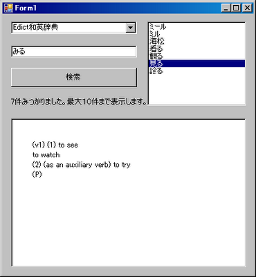

C#からWebサービスを扱う練習をしてみました。例として、イースト辞書Webサービスを利用しようと思い[宇宙仮面の C# プログラミング](http://uchukamen.com/)の[こちらのページ](http://uchukamen.com/Programming4/WebDict/index.htm)のソースコードを参考にしました(謝々)。 SOAP版APIの最新バージョンがv10になり、仕様が変更になったので以下にそれに対応したソースコードを示します。

### 実行結果

[](./re_webdict01.png)

## ソースコード

### Form1.cs


```csharp
 using System; using System.Collections.Generic; using System.ComponentModel; using System.Data; using System.Drawing; using System.Text; using System.Windows.Forms; using netdictist.jp.co.est.btonic; // Webサービスの名前空間を追加 namespace netdictist { public partial class Form1 : Form { public Form1() { InitializeComponent(); } private NetDicV10 netDicV10 = null; // Web Service インスタンス格納用変数 private DicInfo[] dicInfoList = null; // 辞書情報の配列（出力） private DicInfo currentDict = null; // 辞書 private DicItem[] itemList = null; // 辞書項目の配列（出力） private void Form1_Load(object sender, EventArgs e) { #region ComboBox に辞書リストを設定する。 // Web辞書検索サービスのインスタンスを作成する。 this.netDicV10 = new NetDicV10(); // 辞書のリストを取得する。 dicInfoList = netDicV10.GetDicList(""); foreach (DicInfo dicInfo in dicInfoList) { // comboBox1に項目を追加 int index = this.comboBox1.Items.Add(dicInfo.FullName); if (index == 2) break; } this.comboBox1.SelectedIndex = 0; #endregion } // 辞書が変更になった。 private void comboBox1_SelectedIndexChanged(object sender, EventArgs e) { this.currentDict = this.dicInfoList[this.comboBox1.SelectedIndex]; } private void button1_Click(object sender, EventArgs e) { DicInfo d = this.currentDict; // 選択された辞書 uint reqItemIndex = 0; // 取得する辞書項目の開始インデックス uint reqItemTitleCount = 10; // 取得する辞書項目の数 uint reqItemContentCount = 10; // 内容も同時に取得する辞書項目の数 uint itemCountTotal; // 見つかった辞書項目数（出力） Cursor cursor = this.Cursor; this.Cursor = Cursors.WaitCursor; // Wait Cursor にする。 Query[] qw = new Query[1]; // クエリ構造体 qw[0] = new Query(); qw[0].Words = this.tbSearchText.Text; qw[0].ScopeID = d.ScopeList[0].ID; //グローバル一意識別子(GUID)の作成 Guid[] dicGuid = new Guid[1]; dicGuid[0] = System.Guid.NewGuid(); dicGuid[0] = d.DicID; ContentProfile cp = new ContentProfile(); cp.CharsetOption = CharsetOption.UNICODE; // 使用文字セット指定 cp.FormatType = "XHTML"; cp.ResourceOption = ResourceOption.URI; itemCountTotal = netDicV10.SearchDicItem( "", // 認証チケット文字列 dicGuid, // 辞書ID qw, // 検索語(クエリ構造体) cp, // ContentProfile構造体 "", // ソート用(使用しない) reqItemIndex, // 取得する辞書項目の開始インデックス reqItemTitleCount, // 取得する辞書項目の数 reqItemContentCount, // 内容も同時に取得する辞書項目の数 out itemList // 辞書項目の配列（出力） ); this.Cursor = cursor; // Cursor を元に戻す。 this.labelMessage.Text = itemCountTotal.ToString() + "件みつかりました。最大１０件まで表示します。"; this.listBox1.Items.Clear(); foreach (DicItem dicItem in itemList) { this.listBox1.Items.Add(dicItem.Title.InnerText); } } // 検索結果のリストをセレクトしたので、詳細を表示する。 private void listBox1_SelectedIndexChanged(object sender, EventArgs e) { string dictext = this.itemList[this.listBox1.SelectedIndex].Body.InnerText; this.richTextBox1.Text = dictext; } } } 
```


### Form1.Designer.cs


```csharp
 namespace netdictist { partial class Form1 { /// /// 必要なデザイナ変数です。 /// private System.ComponentModel.IContainer components = null; /// /// 使用中のリソースをすべてクリーンアップします。 /// /// マネージ リソースが破棄される場合 true、破棄されない場合は false です。 protected override void Dispose(bool disposing) { if (disposing && (components != null)) { components.Dispose(); } base.Dispose(disposing); } #region Windows フォーム デザイナで生成されたコード /// /// デザイナ サポートに必要なメソッドです。このメソッドの内容を /// コード エディタで変更しないでください。 /// private void InitializeComponent() { this.comboBox1 = new System.Windows.Forms.ComboBox(); this.tbSearchText = new System.Windows.Forms.TextBox(); this.button1 = new System.Windows.Forms.Button(); this.labelMessage = new System.Windows.Forms.Label(); this.listBox1 = new System.Windows.Forms.ListBox(); this.richTextBox1 = new System.Windows.Forms.RichTextBox(); this.SuspendLayout(); // // comboBox1 // this.comboBox1.FormattingEnabled = true; this.comboBox1.Location = new System.Drawing.Point(14, 12); this.comboBox1.Name = "comboBox1"; this.comboBox1.Size = new System.Drawing.Size(204, 20); this.comboBox1.TabIndex = 0; this.comboBox1.SelectedIndexChanged += new System.EventHandler(this.comboBox1_SelectedIndexChanged); // // tbSearchText // this.tbSearchText.Location = new System.Drawing.Point(14, 51); this.tbSearchText.Name = "tbSearchText"; this.tbSearchText.Size = new System.Drawing.Size(204, 19); this.tbSearchText.TabIndex = 1; // // button1 // this.button1.Location = new System.Drawing.Point(14, 87); this.button1.Name = "button1"; this.button1.Size = new System.Drawing.Size(204, 31); this.button1.TabIndex = 2; this.button1.Text = "検索"; this.button1.UseVisualStyleBackColor = true; this.button1.Click += new System.EventHandler(this.button1_Click); // // labelMessage // this.labelMessage.AutoSize = true; this.labelMessage.Location = new System.Drawing.Point(12, 136); this.labelMessage.Name = "labelMessage"; this.labelMessage.Size = new System.Drawing.Size(136, 12); this.labelMessage.TabIndex = 3; this.labelMessage.Text = "最大１０件まで表示します。"; // // listBox1 // this.listBox1.Anchor = ((System.Windows.Forms.AnchorStyles)(((System.Windows.Forms.AnchorStyles.Top | System.Windows.Forms.AnchorStyles.Bottom) | System.Windows.Forms.AnchorStyles.Left))); this.listBox1.FormattingEnabled = true; this.listBox1.ItemHeight = 12; this.listBox1.Location = new System.Drawing.Point(235, 12); this.listBox1.Name = "listBox1"; this.listBox1.Size = new System.Drawing.Size(160, 136); this.listBox1.TabIndex = 4; this.listBox1.SelectedIndexChanged += new System.EventHandler(this.listBox1_SelectedIndexChanged); // // richTextBox1 // this.richTextBox1.Anchor = ((System.Windows.Forms.AnchorStyles)((((System.Windows.Forms.AnchorStyles.Top | System.Windows.Forms.AnchorStyles.Bottom) | System.Windows.Forms.AnchorStyles.Left) | System.Windows.Forms.AnchorStyles.Right))); this.richTextBox1.Location = new System.Drawing.Point(14, 169); this.richTextBox1.Name = "richTextBox1"; this.richTextBox1.Size = new System.Drawing.Size(381, 241); this.richTextBox1.TabIndex = 5; this.richTextBox1.Text = ""; // // Form1 // this.AutoScaleDimensions = new System.Drawing.SizeF(6F, 12F); this.AutoScaleMode = System.Windows.Forms.AutoScaleMode.Font; this.ClientSize = new System.Drawing.Size(407, 422); this.Controls.Add(this.richTextBox1); this.Controls.Add(this.listBox1); this.Controls.Add(this.labelMessage); this.Controls.Add(this.button1); this.Controls.Add(this.tbSearchText); this.Controls.Add(this.comboBox1); this.Name = "Form1"; this.Text = "Form1"; this.Load += new System.EventHandler(this.Form1_Load); this.ResumeLayout(false); this.PerformLayout(); } #endregion private System.Windows.Forms.ComboBox comboBox1; private System.Windows.Forms.TextBox tbSearchText; private System.Windows.Forms.Button button1; private System.Windows.Forms.Label labelMessage; private System.Windows.Forms.ListBox listBox1; private System.Windows.Forms.RichTextBox richTextBox1; } } 
```


とりあえずこれで一応の動作はしますが、XMLの扱いがずさんなので、これから学んでいく必要があります。  
ともあれ、コーディング中感じたのは、Visual Studioのコード補正と宣言元へのジャンプ機能の強力さ。統合開発環境も使いこなしていきたいです。
