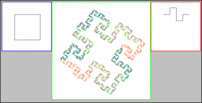

先日X11/Xlib.h、X11/Xutil.hを用いてフラクタルを描画するプログラムを作成していた折、描画する図形を構成する線分の色を変えようと試みた。X Window Systemではあらかじめ定義されている色名があるが、今回は多くの色を扱うためRGB指定での描画色の変更を行う。まず、以下のような整数型のピクセル値を返す関数MyColorを作成する。 
<!-- truncate -->
 

```cpp
 #include #include unsigned long MyColor(display, color) Display *display; char *color; { Colormap cmap; XColor c0, c1; cmap = DefaultColormap(display, 0); XAllocNamedColor(display, cmap, color, &c1, &c0); return (c1.pixel); } 
```

 引数colorに以下に示す書式に則ったRGB色を表す文字列を代入しピクセル値を得る。 `"rgb:00/00/FF" (指定した色が青の場合)` ここで得られるピクセル値をXSetForeground関数に代入することでRGB値の指定による描画色の変更を行うことができる。 RGB値指定が可能になることで表現できる色は飛躍的に増えるが、ソースプログラム中にいちいち値を指定した文字列を予め作成しておくのでは、少々非効率である。特にフラクタルのような再起関数を用いる場合、繰り返し回数は等比級数的に増す場合もあり、カラフルな図形の表現を行うには別の手法を試みる必要がある。そこで、上記のRGB値を指定する書式を自動生成する関数のプログラムを以下に示す。 

```cpp
 #include #include // for strdup() // グローバル変数 char *comap[0x1000000]; // RGB形式のカラーマップ int coindex = 0; // カラーマップ用パラメータ int colimit = 0; // カラーマップの個数 // RGBカラーマップを生成 // iの可算度合は色のバラツキ度 void cremap() { char str[16]; int i, j; for(i=0, j=0; i< =0xFFFFFF; i+=0x2888, j++) { sprintf(str, "rgb:%02X/%02X/%02X", // i / 0xFFFF & 0xFF, i / 0xFF & 0xFF, i & 0xFF); // チョイ非効率 (i >> 16) & 0xFF, (i >> 8) & 0xFF, i & 0xFF); // bit演算 comap[j] = strdup(str); //puts(comap[i]); //printf("%d\n", i); } printf("%d\n", j); colimit = j; // 生成した色の数 //exit(0); } 
```

 sprintf関数を用いて書式を指定した文字列を生成することが出来る。for ループのiの増分をi++に変更すれば0xFFFFFF色分のカラーマップを生成できる。ただし、このカラーマップの順序は少々とっぴで、パラメータj順に色を表示すると所所でカラージャンプがあるため、滑らかなグラデーションを生成したい場合はsprintfの引数の指定方法を変える必要がある。 最終的にはソースコード中で以下のように色を変更する一文を加える。 `XSetForeground(d,gc, MyColor(d, comap[lim(++coindex)]));` これによって生成されたフラクタル画像を下図に示す。左がイニシエータ、右がジェネレータ、中央が生成したフラクタル図形。 [](./fractal01s-e1273384232231.png)
