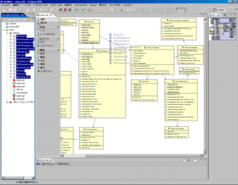

 統合開発環境のEclipseでJavaのオセロプログラム(講義の課題)を制作中に一度クラス図を作成しようと試みました。使用プラグインは[AmaterasUML](http://amateras.osdn.jp/cgi-bin/fswiki/wiki.cgi?page=AmaterasUML)でこちらのサイト([軽量なUMLプラグインAmaterasUML (1/4) - @IT](http://www.atmarkit.co.jp/fjava/rensai3/eclipseplgn14/eclipseplgn14_1.html))を参考にしながらインストールを進めました。 さて、数あるUMLデザイナの中でこのプラグインのアドバンテージの一つはJavaクラスの継承関係などを包含したクラス図をソースコードから生成できる点にあると私は考えます。 その作り方は、まず「ファイル」→「新規」→「その他」から「AmaterasUML」→「クラス図」と選択してクラス図ファイルを作成し、そのファイルをダブルクリックしクラス図エディタを起動します。その上にクラスファイルをドラックアンドドロップすれば、そのクラスのクラス図が作成されます。また継承関係などを表したい場合は、その関係のクラスを選択した上でドラッグ＆ドロップすればOK。下図にその使用状況を示します。  ちなみに、これによって作成された図は画像形式でエクスポートできます。 人にプログラムの構造の説明する際に役立つので重宝しています。
