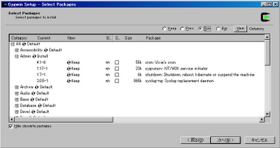

Linux系OSに入っているタスクを自動実行するためのデーモンプロセス、cronをWindows環境でも使用するため,Cygwin((UNIXのフリーソフトウェア等をWindowsに移植したもの))を用いてcronをインストール。 まず、[Cygwin Information and Installation](http://cygwin.com/)からCygwinをダウンロードしセットアップを開始。セットアップを進めていくと下の画面でインストールするパッケージを選択できます。ここでAdmin内のcronとcygrunsrvをInstallすればOK。  インストール後、サービスの設定には主に以下のサイトを参考にしました。

- [cygwin で cron を使う](http://sonic64.com/2004-06-23.html)
- [Are You Cygwin Tonight? - cron](http://www.amy.hi-ho.ne.jp/tachibana/cygwin/cron.html)
