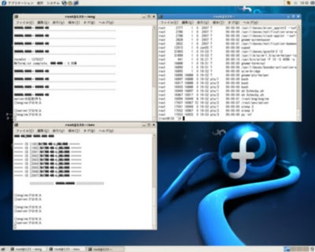

[](./shellscriptREg.jpg)

先日書いた[シェルスクリプトでプロセスを監視し自動実行＆自動kill](/blog/shell-script-kill-process "Shell Scriptでサーバのプロセスをモニタリング")のシェルスクリプトは、その後結局使わず、さらに簡易的なコードで済ませました。

### クエリーサーバのチェックスクリプト

scheckp.sh


```bash
#!/usr/bin/sh
while true
do
  isAliveSev=`ps -ef | grep "/server" | grep -v grep | wc -l`
  if [ $isAliveSev = 1 ]; then
    echo "o:server process"
  else
    echo "x:server process"
    /ret/sev/server &
  fi
  sleep 300 # モニター間隔(秒単位)
done
```


### エンジンサーバのチェックスクリプト

echeckp.sh


```bash
#!/usr/bin/sh
while true
do
  isAliveEng=`ps -ef | grep "/engine" | grep -v grep | wc -l`
  if [ $isAliveEng = 1 ]; then
    echo "o:engine process"
      else
    echo "x:engine process"
    /ret/eng/engine &
  fi
  sleep 300 # モニター間隔(秒単位)
done
```


