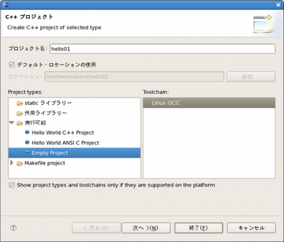

以前、K-na TechNotes | Homeのページを参考にWindowsでEclipse3.3とCDTをインストールしました。分かりやすく書かれており、とても参考になりました(謝々)。 たまたまK-na TechNotes | CDT のトラブル対策ページ下部にある

> ＜実行＞を押しても、デバッグしても、必ず「アプリケーション・エラー 起動に失敗（バイナリ・ファイルがありません）」のメッセージが出ます。

という件を見て、この症状の理由はProject typesの設定ミスではないかと推測しました。 
<!-- truncate -->
 解決方法は、まず上述のページを参照しながら、

- Cygwin か MinGWをインストール及びパスの設定をする
- Eclipse(CDT)をインストールする
- Eclipse上のバイナリパーサの設定等を行う(コンパイルで生成されるバイナリファイルをEclipseで認識させるため)

ここまで出来れば使えるはず。 早速プロジェクトを作成しましょう。 以下の画像はEclipse3.3ですが、Linuxパージョンである。だが、表示項目はWindowsのそれとほとんど変わりません。

### \[ファイル\]＞\[新規\]＞\[Cプロジェクト\]とクリック

 以下の画面で適当なプロジェクト名を打ち込んだ後、Project typesを選択します。ここで\[実行可能\]＞\[Empty Project\]を選択します。Toochainの項目はLinux系なら\[Linux GCC\]であるし、上述の設定を行った場合のWindowsのToochainは\[Cygwin GCC\]を選択します。 これで終了を押せば、問題なくコーディングでき、ビルド→実行となります。

### プロジェクトタイプ(Project types)の設定に注意

ここで、\[Makefile project\]を選択した場合は、Makefileを作成しなければエラーになります。\[static ライブラリー\]を選択した場合はビルドしてもバイナリファイルは生成されないので注意です。

### 雑感

最近はC, C++, C#やJavaにしても統合開発環境があればコーディングやリーディングがしやすいです（ソースの規模にもよりますが）。これを使うことでの弊害も無いとは言えないですが、それはまた別の話で。 RubyやRails, PHPの開発ではどうなのかな。
