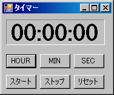
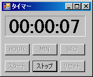

別名、カウントダウンタイマー。今回学んだことは、以下の二点。

- X秒からh:m:s形式での表示。
- タイマースレッドの利用。

タイマーイベント毎に重い処理を行うと表示時間と実時間のずれが大きくなるので注意。その場合はイベント発生間隔を長めに取る。

## プログラムの実行結果

### 起動時

[](./timer01.png)

### 実行時

[](./timer02.png)

尚、ボタンをロック(非活性)するにはボタンインスタンスのEnabledプロパティにfalseを代入する(ロック解除はture)。

例(butstartはボタンクラスのインスタンス変数)：

```
butstart.Enabled = false; // スタートボタンをロック(スタートが押されたら場合)
```

## ソースコード

### FormTimer.cs


```csharp
using System;
using System.Collections.Generic;
using System.ComponentModel;
using System.Data;
using System.Drawing;
using System.Text;
using System.Windows.Forms;
/**
 * キッチンタイマー
 * Web page: https://yukun.info/
 * license GPLv2
 */
namespace Sample
{
  public partial class FormTimer : Form
  {
    public FormTimer()
    {
      InitializeComponent();
      // マウスポインタの場所に表示
      this.DesktopLocation = new Point(System.Windows.Forms.Cursor.Position.X,
        System.Windows.Forms.Cursor.Position.Y);
    }
    int sec = 0; // 計測時間
    private void viewtime()
    {
      stLabel1.Text = "" + sec / 36000 % 10 + sec / 3600 % 10 +
                     ":" + sec / 600 % 6 + sec / 60 % 10 +
                     ":" + sec / 10 % 6 + sec % 10;
    }
    private void timer1_Tick(object sender, EventArgs e)
    {
      sec--;
      if (0 == sec)
      {
        sttimer.Enabled = false;
        System.Media.SystemSounds.Beep.Play();
        this.Activate();
      }
      viewtime();
    }
    private void butsec_Click(object sender, EventArgs e)
    {
      sec += 10;
      viewtime();
    }
    private void butmin_Click(object sender, EventArgs e)
    {
      sec += 60;
      viewtime();
    }
    private void buthour_Click(object sender, EventArgs e)
    {
      sec += 3600;
      if (sec >= 360000) sec = 0;
      viewtime();
    }
    private void butstart_Click(object sender, EventArgs e)
    {
      if (0 == sec) return;
      sttimer.Enabled = true;
      this.butstop.Enabled = true;
      this.butstart.Enabled = false;
      this.buthour.Enabled = false;
      this.butmin.Enabled = false;
      this.butsec.Enabled = false;
      this.butreset.Enabled = false;
    }
    private void butstop_Click(object sender, EventArgs e)
    {
      sttimer.Enabled = false;
      this.butstop.Enabled = false;
      this.butstart.Enabled = true;
      this.buthour.Enabled = true;
      this.butmin.Enabled = true;
      this.butsec.Enabled = true;
      this.butreset.Enabled = true;
    }
    private void butreset_Click(object sender, EventArgs e)
    {
      stLabel1.Text = "00:00:00";
      sec = 0;
    }
    private void 常に手前に表示ToolStripMenuItem_Click(object sender, EventArgs e)
    {
      //クリックするごとにこのフォームを常に手前または解除します。
      this.TopMost = !this.TopMost;
    }
  }
}
```


### FormTimer.Designer.cs


```csharp
namespace Sample
{
  partial class FormTimer
  {
    /// <summary>
    /// 必要なデザイナ変数です。
    /// </summary>
    private System.ComponentModel.IContainer components = null;
    /// <summary>
    /// 使用中のリソースをすべてクリーンアップします。
    /// </summary>
    /// <param name="disposing">マネージ リソースが破棄される場合 true、破棄されない場合は false です。</param>
    protected override void Dispose(bool disposing)
    {
      if (disposing && (components != null))
      {
        components.Dispose();
      }
      base.Dispose(disposing);
    }
    #region Windows フォーム デザイナで生成されたコード
    /// <summary>
    /// デザイナ サポートに必要なメソッドです。このメソッドの内容を
    /// コード エディタで変更しないでください。
    /// </summary>
    private void InitializeComponent()
    {
      this.components = new System.ComponentModel.Container();
      this.sttimer = new System.Windows.Forms.Timer(this.components);
      this.buthour = new System.Windows.Forms.Button();
      this.butmin = new System.Windows.Forms.Button();
      this.butsec = new System.Windows.Forms.Button();
      this.butstart = new System.Windows.Forms.Button();
      this.stLabel1 = new System.Windows.Forms.Label();
      this.butstop = new System.Windows.Forms.Button();
      this.butreset = new System.Windows.Forms.Button();
      this.contextMenuStrip1 = new System.Windows.Forms.ContextMenuStrip(this.components);
      this.常に手前に表示ToolStripMenuItem = new System.Windows.Forms.ToolStripMenuItem();
      this.contextMenuStrip1.SuspendLayout();
      this.SuspendLayout();
      //
      // sttimer
      //
      this.sttimer.Interval = 1000;
      this.sttimer.Tick += new System.EventHandler(this.timer1_Tick);
      //
      // buthour
      //
      this.buthour.Location = new System.Drawing.Point(6, 66);
      this.buthour.Name = "buthour";
      this.buthour.Size = new System.Drawing.Size(50, 23);
      this.buthour.TabIndex = 0;
      this.buthour.Text = "HOUR";
      this.buthour.UseVisualStyleBackColor = true;
      this.buthour.Click += new System.EventHandler(this.buthour_Click);
      //
      // butmin
      //
      this.butmin.Location = new System.Drawing.Point(62, 66);
      this.butmin.Name = "butmin";
      this.butmin.Size = new System.Drawing.Size(50, 23);
      this.butmin.TabIndex = 1;
      this.butmin.Text = "MIN";
      this.butmin.UseVisualStyleBackColor = true;
      this.butmin.Click += new System.EventHandler(this.butmin_Click);
      //
      // butsec
      //
      this.butsec.Location = new System.Drawing.Point(118, 66);
      this.butsec.Name = "butsec";
      this.butsec.Size = new System.Drawing.Size(50, 23);
      this.butsec.TabIndex = 2;
      this.butsec.Text = "SEC";
      this.butsec.UseVisualStyleBackColor = true;
      this.butsec.Click += new System.EventHandler(this.butsec_Click);
      //
      // butstart
      //
      this.butstart.Location = new System.Drawing.Point(6, 100);
      this.butstart.Name = "butstart";
      this.butstart.Size = new System.Drawing.Size(50, 23);
      this.butstart.TabIndex = 3;
      this.butstart.Text = "スタート";
      this.butstart.UseVisualStyleBackColor = true;
      this.butstart.Click += new System.EventHandler(this.butstart_Click);
      //
      // stLabel1
      //
      this.stLabel1.AutoSize = true;
      this.stLabel1.BackColor = System.Drawing.SystemColors.Control;
      this.stLabel1.BorderStyle = System.Windows.Forms.BorderStyle.Fixed3D;
      this.stLabel1.Font = new System.Drawing.Font("Times New Roman", 30F, System.Drawing.FontStyle.Bold, System.Drawing.GraphicsUnit.Point, ((byte)(128)));
      this.stLabel1.Location = new System.Drawing.Point(6, 9);
      this.stLabel1.Name = "stLabel1";
      this.stLabel1.Size = new System.Drawing.Size(163, 42);
      this.stLabel1.TabIndex = 4;
      this.stLabel1.Text = "00:00:00";
      //
      // butstop
      //
      this.butstop.Location = new System.Drawing.Point(62, 100);
      this.butstop.Name = "butstop";
      this.butstop.Size = new System.Drawing.Size(50, 23);
      this.butstop.TabIndex = 5;
      this.butstop.Text = "ストップ";
      this.butstop.UseVisualStyleBackColor = true;
      this.butstop.Click += new System.EventHandler(this.butstop_Click);
      //
      // butreset
      //
      this.butreset.Location = new System.Drawing.Point(118, 100);
      this.butreset.Name = "butreset";
      this.butreset.Size = new System.Drawing.Size(50, 23);
      this.butreset.TabIndex = 6;
      this.butreset.Text = "リセット";
      this.butreset.UseVisualStyleBackColor = true;
      this.butreset.Click += new System.EventHandler(this.butreset_Click);
      //
      // contextMenuStrip1
      //
      this.contextMenuStrip1.Items.AddRange(new System.Windows.Forms.ToolStripItem[] {
      this.常に手前に表示ToolStripMenuItem});
      this.contextMenuStrip1.Name = "contextMenuStrip1";
      this.contextMenuStrip1.Size = new System.Drawing.Size(171, 26);
      //
      // 常に手前に表示ToolStripMenuItem
      //
      this.常に手前に表示ToolStripMenuItem.CheckOnClick = true;
      this.常に手前に表示ToolStripMenuItem.Name = "常に手前に表示ToolStripMenuItem";
      this.常に手前に表示ToolStripMenuItem.Size = new System.Drawing.Size(170, 22);
      this.常に手前に表示ToolStripMenuItem.Text = "常に Top に表示する";
      this.常に手前に表示ToolStripMenuItem.Click += new System.EventHandler(this.常に手前に表示ToolStripMenuItem_Click);
      //
      // FormTimer
      //
      this.AutoScaleDimensions = new System.Drawing.SizeF(6F, 12F);
      this.AutoScaleMode = System.Windows.Forms.AutoScaleMode.Font;
      this.ClientSize = new System.Drawing.Size(180, 129);
      this.ContextMenuStrip = this.contextMenuStrip1;
      this.Controls.Add(this.butreset);
      this.Controls.Add(this.butstop);
      this.Controls.Add(this.stLabel1);
      this.Controls.Add(this.butstart);
      this.Controls.Add(this.butsec);
      this.Controls.Add(this.butmin);
      this.Controls.Add(this.buthour);
      this.Name = "FormTimer";
      this.StartPosition = System.Windows.Forms.FormStartPosition.Manual;
      this.Text = "タイマー";
      this.contextMenuStrip1.ResumeLayout(false);
      this.ResumeLayout(false);
      this.PerformLayout();
    }
    #endregion
    private System.Windows.Forms.Button buthour;
    private System.Windows.Forms.Button butmin;
    private System.Windows.Forms.Button butsec;
    private System.Windows.Forms.Button butstart;
    private System.Windows.Forms.Label stLabel1;
    private System.Windows.Forms.Button butstop;
    private System.Windows.Forms.Button butreset;
    private System.Windows.Forms.Timer sttimer;
    private System.Windows.Forms.ContextMenuStrip contextMenuStrip1;
    private System.Windows.Forms.ToolStripMenuItem 常に手前に表示ToolStripMenuItem;
  }
}
```


