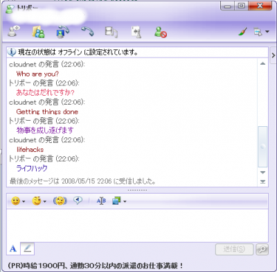

POSTメソッドを用いてWebページのフォームにリクエストを送信し、そのレスポンスを取得するプログラム例として、[エキサイト 翻訳](https://www.excite.co.jp/world/)を利用してみます。 送信クエリの1つは翻訳言語設定、2つ目は翻訳対象文字列でレスポンスのWebページから翻訳された文字列を抽出します。

### ソースコード


```java
import java.net.*;
import java.util.regex.*;
import java.io.*;
/**
 * Excite翻訳(http://www.excite.co.jp/world/)を利用するクラス
 */
public class ExciteTrans {
  private String direction; // 翻訳する言語設定 "ENJA" or "JAEN"
  /** テスト用main() */
  public static void main(String[] args) {
    ExciteTrans et = new ExciteTrans();
    System.out.println(et.getTransText("Hello!")); // 翻訳対象テキスト
  }
  /** コンストラクタ */
  public ExciteTrans() { direction ="ENJA"; }
  public ExciteTrans(String str) {
    if (str.equals("JAEN") || str.equals("ENJA"))
      direction = str;
    else
      direction ="JAEN";
  }
  /**
   * テキストを翻訳
   * @param before 翻訳前のテキスト
   * @return 翻訳後のテキスト
   */
  public String getTransText(String before) {
    String afterText = null; // 翻訳されたテキスト
    try {
      // URLクラスのインスタンスを生成
      URL exciteURL =
        new URL("http://www.excite.co.jp/world/english/");
      // 接続します
      URLConnection con = exciteURL.openConnection();
      // 出力を行うように設定
      con.setDoOutput(true);
      // 出力ストリームを取得
      PrintWriter out = new PrintWriter(con.getOutputStream());
      // クエリー文の生成・送信
      out.print("before={"+ before +"}&wb_lp={"+ direction +"}");
      out.close();
      // 入力ストリームを取得
      BufferedReader in = new BufferedReader(new InputStreamReader(con.getInputStream()));
      // 一行ずつ読み込む
      String aline;
      // 抽出用の正規表現
      String regex = "<textarea [^>].*after.*>(.*)";
      Pattern pattern = Pattern.compile(regex);
      while ((aline = in.readLine()) != null) {
        Matcher mc = pattern.matcher(aline);
        if(mc.matches()) {
          afterText = mc.group(1);
        }
      }
      in.close(); // 入力ストリームを閉じる
    } catch (IOException e) {
      e.printStackTrace();
    }
    return afterText;
  }
}
```

 <h3>実行結果</h3> <pre>こんにちは!</pre> <h3>Java MSN Messenger Library (JML)で翻訳ロボを作る</h3> <a href="https://sourceforge.net/projects/java-jml/">Java MSN Messenger Library (JML)</a>とは Windows Live Messenger 上の通信プロトコルMSNP8-MSNP12をサポートするライブラリです。主に、メンバーの会話に自動応答するチャットボット(Chat Bot)や人工無脳などを作る際に用いられます。 今回は、ライブラリに付属しているサンプルプログラムのEchoMessengerクラスにこの翻訳クラスをかませて、メンバーの発言を翻訳し、その文字列色をランダムで選択した色で応答するチャットボットを作成してみました。 実行結果は下図になります。  コンストラクタでの翻訳言語設定が逆でも、文字列が英語or日本語に統一されていれば、Excite翻訳側がそれに合わせて適当な言語で翻訳するみたいです。 最後に、 <h3>礼儀正しくクローリングする際は</h3> <ul> <li>robots.txtやメタタグを守るように</li> <li>相手サーバに負荷をかけすぎないように</li> <li>相手Webサイトポリシー(利用規約)を守るように</li> <li>頻繁に使いたいモノなら、同機能のWebサービスを使うこと(利用規約内で)</li> </ul> うーん、今回のようなプログラムの利用はあまりよくないようでね。</x-turndown>
