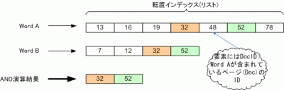

### AND演算処理の概要

[](./intersection-e1269626508439.gif) 上の図から、ある2つの語の転置インデックスリストをA, Bとします。ここで、要素をそれぞれa, b(整数)とし演算結果を格納するリストをCとするとき、AND演算は主に以下の処理内容を繰り返します。

1. if a < b then aの次の要素をaに代入
2. if a = b then 要素aをCの末尾に追加しA, Bが指す要素を一つ進める

### プログラムの主な処理内容

1. 検索対象テキストを単語に分割。
2. 単語を転置インデックスに登録。ここで、1単語あたりに格納する情報は、その単語の出現頻度とその文書ID。転置インデックスのデータ構造はTreeMapを使用しkeyに単語、valueはIndexRecordでputします。
3. ユーザからの標準入力をパースしAND演算(Intersectメソッドで実現しています)。

以下に、ソースコードと実行結果を示します。

### IndexRecord.java

1つのトークン(単語)に対するインデックス情報（docIDリストや出現頻度情報） 

```java
 import java.util.ArrayList; /* * 1つのトークン(単語)に対するインデックス情報 */ public class IndexRecord { // 出現文書IDリスト(通常ソートの必要あり) private ArrayList posts; // 出現頻度(今回は同一doc内の頻度はカウントしない) private int freq; public IndexRecord(int id) { posts = new ArrayList(); posts.add(id); freq = 1; } /** docIDをリストに追加(今回は同一docIDのtermはカウントしない) */ public void addDocID(int id) { if (!existDocID(id)) { posts.add(id); // docIDの追加 freq++; // 出現頻度のカウントアップ } } /** docIDが既にリスト中に存在するか否か */ public boolean existDocID(int id) { return (posts.indexOf(id) != -1) ? true : false; } public String toString() { String str = freq + ", "+ posts; return str; } public ArrayList getPosts() { return posts; } } 
```


### BooleanTest.java (AND演算のテストプログラム)


```java
 import java.io.BufferedReader; import java.io.IOException; import java.io.InputStreamReader; import java.util.ArrayList; import java.util.Collections; import java.util.StringTokenizer; import java.util.TreeMap; /** * 検索エンジンのAND演算処理 * Web page: https://yukun.info/ * license GPL */ public class BooleanTest { // 検索対象テキスト static String doc0 = "It is meaningless only to think my long further aims idly. "+ "It is important to set my aims but at the same time I should confirm my present condition. "+ "Unless I set the standard where I am in any level, I'll be puzzled about what I should do from now on. It's in my case."; static String doc1 = "Today, I enjoyed playing with friends daytime. "+ "After enjoying, I got back to my daily life with an vigorous power. "+ "I should think so, but why did I feel touch of uncertainty and regret? "+ "I wanna enjoy myself and another tremendously during the day when I've played. "+ "Well, As well as I commit play to quality, I'll choose such kinds of play."; static String doc2 = "I'll manage the limited time in a day. "+ "I think that I divide the time into some intervals such as 5 minutes, "+ "15 minutes and more than one hour and so on. I'll make use of this character of the interval."; public static void main(String[] args) { ArrayList docIDlist = new ArrayList(); // 文書を格納 docIDlist.add(doc0); docIDlist.add(doc1); docIDlist.add(doc2); StringTokenizer st[] = new StringTokenizer[3]; String stripChars = ".,:;?!"'[]{}()"; // 除外文字 // 文字列を空白で区切るよう設定 for (int i = 0; i < st.length; i++) { st[i] = new StringTokenizer(docIDlist.get(i), " "); } // 転置インデックス用のMap TreeMap termMap = new TreeMap(); // 分割されたトークンを取得 for (int i = 0; i < st.length; i++) { // ここでのパラメータiはdocIDを指すことと同じ while (st[i].hasMoreTokens()) { // 文字列トークンの先頭・末尾の文字をフィルタリング // org.apache.commons.lang.StringUtilsクラスを使用 // http://commons.apache.org/proper/commons-lang/ String term = StringUtils.strip(st[i].nextToken(), stripChars); //System.out.println("値 : " + term); if(termMap.containsKey(term)) { // 登録されているtermならdocIDの追加とカウントアップ IndexRecord ir = termMap.get(term); ir.addDocID(i); termMap.put(term, ir); } else { // termMapに登録されていないtermならdocIDと合わせて登録 termMap.put(term, new IndexRecord(i)); } } } // for loop ends // termMapのデバッグプリント System.out.println("単語 freq, docID"); for (String part : termMap.keySet()) { System.out.printf("%-12s : %sn", part, termMap.get(part)); } BufferedReader br = new BufferedReader(new InputStreamReader(System.in)); String words = ""; while (true) { ArrayList> postsSet = new ArrayList>(); System.out.print("検索語: "); try { // ユーザからの標準入力を受付 words = br.readLine(); if (words.equals("quit")) break; // 入力文字列をパース StringTokenizer parser = new StringTokenizer(words, " "); while (parser.hasMoreTokens()) { String term = StringUtils.strip(parser.nextToken(), stripChars); // termMapに登録されている単語か否か if (termMap.containsKey(term)) { postsSet.add(termMap.get(term).getPosts()); } else { postsSet = null; break; } } // AND演算処理 ArrayList result = intersect(postsSet); System.out.print("結果　:"); if (result == null || result.size() == 0) System.out.println("文書中に存在しません。"); else System.out.println("文書ID "+ result +"に存在します。"); } catch (IOException e) { e.printStackTrace(); } } } // main() ends // AND演算処理メソッド public static ArrayList intersect(ArrayList> postsSet) { if (postsSet == null) return null; int len = postsSet.size(); if (len == 0) return null; else if (len == 1) return postsSet.get(0); // postsSetを昇順にソート(演算回数の削減) Collections.sort(postsSet, new FreqComparator()); ArrayList< Integer > result = postsSet.get(0); for (int i = 1; i < len; i++) { result = intersect(result, postsSet.get(i)); } return result; } public static ArrayList intersect(ArrayList p1, ArrayList p2) { ArrayList answer = new ArrayList(); int len1 = p1.size(); int len2 = p2.size(); for (int i=0, j=0; i< len1 && j < len2; ) { if (p1.get(i) == p2.get(j)) { answer.add(p1.get(i)); i++; j++; } else if (p1.get(i) < p2.get(j)) { i++; } else { j++; } } return answer; } } 
```


### FreqComparator.java (ArrayList要素のソート用)


```java
 import java.util.ArrayList; import java.util.Comparator; public class FreqComparator implements Comparator{ public int compare(Object o1, Object o2){ return ((ArrayList) o1).size() - ((ArrayList) o2).size(); } } 
```


### 実行結果

```
単語          freq, docID
15           : 1, [2]
5            : 1, [2]
After        : 1, [1]
As           : 1, [1]
I            : 3, [0, 1, 2]
＜中略＞
set          : 1, [0]
should       : 2, [0, 1]
so           : 2, [1, 2]
some         : 1, [2]
standard     : 1, [0]
such         : 2, [1, 2]
than         : 1, [2]
that         : 1, [2]
the          : 3, [0, 1, 2]
think        : 3, [0, 1, 2]
this         : 1, [2]
time         : 2, [0, 2]
to           : 2, [0, 1]
touch        : 1, [1]
＜中略＞
検索語: think that
結果　:文書ID [2]に存在します。
検索語: wanna play to
結果　:文書ID [1]に存在します。
検索語: the java
結果　:文書中に存在しません。
検索語: should so
結果　:文書ID [1]に存在します。
検索語: time to
結果　:文書ID [0]に存在します。
検索語: well only
結果　:文書中に存在しません。
検索語: the time
結果　:文書ID [0, 2]に存在します。
検索語: quit
```

おー、なんだか楽しくなってきましたね。

### 文字列の区切り方

今回は検索対象テキストを英文に絞ったため、テキスト中の空白文字で区切ることでトークンを抽出できました。対して、日本語テキストの場合は区切り記号等は無い為、n-gramか形態素辞書などを用いてトークンに区切ることで実現できます。日本語文の区切り方は色々ありますが、中でも簡単な方法は、文字種（英文字、記号、ひらがな、カタカナ、漢字）の違いを区切りの境界と捉える方法です。 余談ですが、ブラウザやエディタ等で文字の上でダブルクリックするとカーソル下の文字列が選択状態になりますが、その範囲を決定する際に上述の方法が応用されているようです。ソフトによってはトリプルクリックするとカーソル下の行全体が選択状態になります（使うと編集が楽です）。
