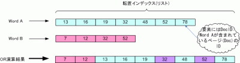

前回が[AND演算](/blog/java-intersection "検索エンジンを実装 (4)AND演算 | Trump Code")でしたので今回はOR演算ついて紹介します。今記事で紹介している演算アルゴリズムよりも高効率なものは存在するようですが、今回は割愛します。

### OR演算処理の概要

[](./union-e1269626394691.gif)

上の図から、ある2つの語の転置インデックスリストをA, Bとします。ここで、リスト要素をそれぞれa, b(整数)とし演算結果を格納するリストをCとするとき、OR演算は主に以下の処理内容を繰り返します。

1. if a < b then 要素aをCの末尾に追加し、aにリストAの次の要素を代入
2. if a = b then 要素aをCの末尾に追加し、A, Bが指す次の要素をa, bに代入
3. if a > b then 要素bをCの末尾に追加し、bにリストBの次の要素を代入

### ソースコード

今回はOR演算処理を行う部分(メソッド)のみを示します。後で示す実行結果は、[前回](/blog/java-intersection "検索エンジンを実装 (4)AND演算")ブログラムをベースにintersect(postsSet)の箇所を今回のものに置き換えたものです。


```java
import java.util.ArrayList;
import java.util.Collections;
/**
 * 検索エンジンのOR演算
 */
public class BooleanRetrieval {
  /**
   * OR演算処理
   * @param postsSet 全ての検索語の転置インデックスリスト
   * @return 演算後の転置インデックスリスト
   */
  public static ArrayList<integer> union(ArrayList<arrayList<integer>> postsSet) {
    ArrayList<integer> result; // 最終演算結果
    if (postsSet == null) return null;
    int len = postsSet.size();
    if (len == 0) return null;
    else if (len == 1) return postsSet.get(0);
    result = postsSet.get(0);
    for (int i = 1; i < len; i++) {
      result = union(result, postsSet.get(i));
    }
    return result;
  }
  public static ArrayList<integer> union(ArrayList<integer> p1, ArrayList<integer> p2) {
    ArrayList<integer> answer = new ArrayList<integer>(); // 2語の演算結果
    int len1 = p1.size();
    int len2 = p2.size();
    int i=0, j=0;
    while (i<len1 && j<len2) {
      int diff = p1.get(i) - p2.get(j);
      if (diff == 0) {
        answer.add(p1.get(i));
        i++; j++;
      } else if (diff < 0) {
        answer.add(p1.get(i));
        i++;
      } else {
        answer.add(p2.get(j));
        j++;
      }
    }
    while (i<len1) { answer.add(p1.get(i++)); }
    while (j<len2) { answer.add(p2.get(j++)); }
    return answer;
  }
}
```


```
単語          freq, docID
15           : 1, [2]
5            : 1, [2]
After        : 1, [1]
As           : 1, [1]
I            : 3, [0, 1, 2]
＜中略＞
should       : 2, [0, 1]
so           : 2, [1, 2]
some         : 1, [2]
standard     : 1, [0]
such         : 2, [1, 2]
than         : 1, [2]
that         : 1, [2]
the          : 3, [0, 1, 2]
think        : 3, [0, 1, 2]
this         : 1, [2]
time         : 2, [0, 2]
to           : 2, [0, 1]
touch        : 1, [1]
tremendously : 1, [1]
uncertainty  : 1, [1]
use          : 1, [2]
vigorous     : 1, [1]
wanna        : 1, [1]
well         : 1, [1]
what         : 1, [0]
when         : 1, [1]
where        : 1, [0]
why          : 1, [1]
with         : 1, [1]
検索語: the when
結果　:文書ID [0, 1, 2]に存在します。
検索語: should so
結果　:文書ID [0, 1, 2]に存在します。
検索語: this touch
結果　:文書ID [1, 2]に存在します。
検索語: use than
結果　:文書ID [2]に存在します。
検索語: where why
結果　:文書ID [0, 1]に存在します。
検索語: quit
```

おー、なんだかもりあがってきましたねー。

話は変わりますが、最近よく実感していることの一つに、ソフトウェアの仕様が変更されると場合によっては設計を根本から変える必要があること。

そして、手がけているソフトウェアが今後アップグレードを繰り返していくと予測できるなら、現時点で取り組んでいる設計に費やす時間はほどほどに、ということです。OO分析設計を用いて保守性・拡張性を高めるのもいいけれど、その設計上での拡張が今後の仕様変更に耐えうるとは限りません。

勿論、最初の設計が肝心であることには変わりないですけれど。それでも留意。
