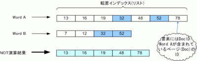

今回は集合演算のNOT演算ついて紹介します。この処理は、例として検索の際に「sky NOT rain」と指定すると、"sky"というキーワードを含むページから"rain"を含むページを除きます。

### NOT演算処理の概要

[](./subtraction-e1269626228977.gif)

上の図から、ある2つの語の転置インデックスリストをA, Bとします。ここで、リスト要素をそれぞれa, b(整数)とし演算結果を格納するリストをCとするとき、NOT演算は主に以下の処理内容を繰り返します。

1. if a < b then 要素aをCの末尾に追加し、aにリストAの次の要素を代入
2. if a = b then A, Bが指す次の要素をa, bに代入
3. if a > b then bにリストBの次の要素を代入

### ソースコード

今回はNOT演算処理を行う部分(メソッド)のみを示します。後で示す実行結果は、[前のブログラム](/blog/java-intersection "検索エンジンを実装 (4)AND演算")をベースにintersect()メソッドの挿入箇所を今回のものに置き換えたものです。


```java
import java.util.ArrayList; /** * 検索エンジンのNOT演算 */ public class BooleanRetrieval { /** * NOT演算処理 * @param postsSet 全ての検索語の転置インデックスリスト * @return 演算後の転置インデックスリスト */ public static ArrayList subtract(ArrayList> postsSet) { ArrayList result; // 最終演算結果 if (postsSet == null) return null; int len = postsSet.size(); if (len == 0) return null; else if (len == 1) return postsSet.get(0); result = postsSet.get(0); for (int i = 1; i < len; i++) { result = subtract(result, postsSet.get(i)); } return result; } public static ArrayList subtract(ArrayList p1, ArrayList p2) { ArrayList answer = new ArrayList(); // 2語の演算結果 int len1 = p1.size(); int len2 = p2.size(); int i=0, j=0; while (iNOT演算の実行結果
```


```
単語          freq, docID
15           : 1, [2]
5            : 1, [2]
After        : 1, [1]
As           : 1, [1]
I            : 3, [0, 1, 2]
＜中略＞
that         : 1, [2]
the          : 3, [0, 1, 2]
think        : 3, [0, 1, 2]
this         : 1, [2]
time         : 2, [0, 2]
to           : 2, [0, 1]
touch        : 1, [1]
tremendously : 1, [1]
uncertainty  : 1, [1]
use          : 1, [2]
vigorous     : 1, [1]
wanna        : 1, [1]
well         : 1, [1]
what         : 1, [0]
when         : 1, [1]
where        : 1, [0]
why          : 1, [1]
with         : 1, [1]
検索語: the think
結果　:文書中に存在しません。
検索語: the use
結果　:文書ID [0, 1]に存在します。
検索語: the to
結果　:文書ID [2]に存在します。
検索語: quit
```

おー、けっこうたのしくなってきましたねー。
