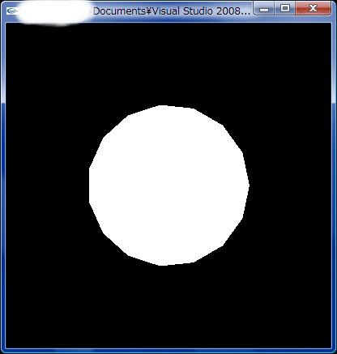
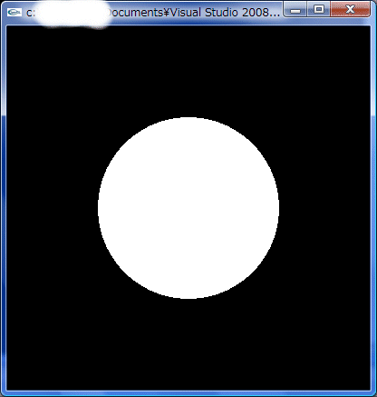

円周上の座標(x, y)×n個を計算しその点を結ぶことによって描画します。nを分割数とすると、nに比例して円は滑らかになります。


<!-- truncate -->


### 実行結果

- 分割数: 15(ちょっとカクカクしてる)

[](./circleP15.gif)  

- 分割数: 100

[](./circleP100.gif)

### コード


```cpp
 // OpenGLで円の描画 #include #include #include #include #include #define M_PI 3.14159265358979 // 円周率 #define PART 100 // 分割数 void display(void) { int i, n = PART; float x, y, r = 0.5; double rate; glClear(GL_COLOR_BUFFER_BIT); // ウィンドウの背景をglClearColor()で指定された色で塗りつぶす glColor3f(1.0, 1.0, 1.0); // 描画物体に白色を設定 glBegin(GL_POLYGON); // ポリゴンの描画 // 円を描画 for (i = 0; i < n; i++) { // 座標を計算 rate = (double)i / n; x = r * cos(2.0 * M_PI * rate); y = r * sin(2.0 * M_PI * rate); glVertex3f(x, y, 0.0); // 頂点座標を指定 } glEnd(); // ポリゴンの描画終了 glFlush(); // OpenGLのコマンドを強制的に実行(描画終了) } void init(char *name) { int width = 400, height = 400; // ウィンドウサイズ int w_window = glutGet(GLUT_SCREEN_WIDTH), h_window = glutGet(GLUT_SCREEN_HEIGHT); // デスクトップのサイズ int w_mid = (w_window-width)/2, h_mid = (h_window-height)/2; // デスクトップの中央座標 glutInitWindowPosition(w_mid, h_mid); glutInitWindowSize(width, height); glutInitDisplayMode(GLUT_RGBA); // 色の指定にRGBAモードを使用 glutCreateWindow(name); glClearColor(0.0, 0.0, 0.0, 1.0); // ウィンドウの背景色の指定 glMatrixMode(GL_PROJECTION); glLoadIdentity(); glOrtho(-1.0, 1.0, -1.0, 1.0, -1.0, 1.0); // 座標系を設定(平行投影) } int main(int argc, char **argv) { glutInit(&argc, argv); // glutの初期化 init(argv[0]); glutDisplayFunc(display); // ディスプレイコールバック関数の指定 glutMainLoop(); // イベント待ちループ return 0; } 
```


そういえば、リアルタイム処理などではポリゴンの数を抑えることで処理速度を稼いでましたね。

参考サイト: [GLUTによる「手抜き」OpenGL入門](http://www.wakayama-u.ac.jp/~tokoi/opengl/libglut.html#5.2 "GLUTによる「手抜き」OpenGL入門")
