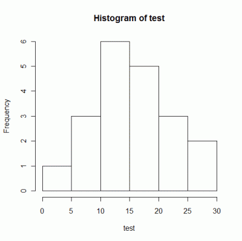

使用データは、ある30点満点のテストの20人分です。

```
19, 28, 4, 23, 8, 7, 20, 8, 12, 22, 19, 18, 14, 13, 13, 25, 12, 16, 11, 26
```

## プロンプト

hist()関数の引数にベクトル変数を代入することでヒストグラムを描画できます。

```
> test <- c(19, 28, 4, 23, 8, 7, 20, 8, 12, 22, 19, 18, 14, 13, 13, 25, 12, 16, 11, 26)
> hist(test)
>

```

## 実行結果

[](./hist_test01-e1272275041994.gif)

横軸が階級値で縦軸が度数（階級に入るデータ数）です。例えば、15**＜**x**≦**20点の範囲の人が5人いる、と読めます。ただし、左端の0点データは0～5の階級に入ります。ここでは範囲の境界に注意しましょう（主に私が）。

## データ作成に使用した乱数生成スクリプト


```python
>>> import random
>>> [random.randint(0, 30) for i in range(20)]
[19, 28, 4, 23, 8, 7, 20, 8, 12, 22, 19, 18, 14, 13, 13, 25, 12, 16, 11, 26]
>>>
```


つい最近慣れ始めたPythonで書いてしまいました。リスト内包表記が地味に便利なところです。リスト内包表記についてはこちらをご覧ください。→[Python: リスト内包表記をfor文に書き換える](/blog/python-list-comprehension "Python: リスト内包表記(リストコンプリヘンション)をfor文に書き換える - Yukun's Blog")

そして、乱数モジュールの使い方に関してはこちらを、→[Python: 乱数の生成 - random()、randint()、uniform()、seed()メソッド](/blog/python-random "Python: 乱数の生成 - random()、randint()、uniform()、seed()メソッド - Yukun's Blog")

また、重複のない乱数を生成するスクリプトはこちらをご覧ください。→[Python: モジュールにテスト関数を定義 - 重複のない乱数(整数MIN以上MAX以下)の生成](/blog/python-random2 "Python: モジュールにテスト関数を定義 - 重複のない乱数(整数MIN以上MAX以下)の生成 - Yukun's Blog")
