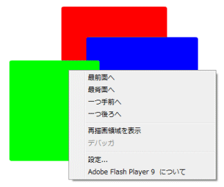

今記事で4回目ですねー。デモは以下のページに用意しました。

今回の主な追加機能は、[前回](/blog/actionscript-paint-flash-flex-draw-tool "AS3でお絵かきFlashを作る (3)図形描画と配置選択ツールの追加 - Yukun's Blog")の改善点にも含まれていた (1)長方形と楕円描画ツールへの「塗りつぶし」機能 (2)各描画図形間のレイヤー（重なり具合）移動機能 です。あと少しインスタンスの生成を押さえた処理に変更したので若干パフォーマンスが上がっているかと思います（約1割弱）。 まず、(2)のオブジェクト間の階層（レイヤー）移動機能ですが、これは描画した図形上で右クリックを押すことで呼び出せるコンテキストメニューから使えます（下図）。  この機能で図形の重なり順序を調節することが出来ます。また、「配置」ツールで図形を選択するとその図形は自動的に最前面レイヤーに移動されます。これによって、マウスイベントの発生源を図形毎に持たせても、重なり具合によるイベントの取りこぼしか無くなる利点があります。結果、OOPにある程度沿ったプログラミングを行うことを可能にします。 ちなみにこのレイヤー移動アクションは履歴には記録せずundo、redoの対象にはしませんでした（このレベルのアプリに対しては必要ないかと思ったので）。もし貼り絵のように絵を描きたく、またundoを利用していきたい場合はPhotoshopやGIMP等の明確なレイヤー機構を実装したほうがすっきりすると思います。内部機能の実装の手間はさほど掛かりませんが、ツールボックスのようなUIを作らなくてはいけないのが今の私にとってメンドイところです。しかしFlexコンポーネントを学ぶ良い機会でもあるのでさわりだけでもやってみようかな。 こう機能が増えてくるとユーザインターフェース(UI)にもしっかり取り組まなければならないんですが、UIはリリースするプラットフォーム（PCデスクトップ上、PCブラウザ上、モバイル、スマートフォン）に依存する部分が大きいのでまだ取り掛かるのはいいかなと思ったり（ぉぃ）。 さて、今回で基本的なブラシツール（ベクター以外）は揃ったかと思いますので、そろそろテキスト系の機能を実装していきたいと思います。初回に「頭の中のアイディアを楽しくまとめられるツールを作ってみたい」とのたまっていたので、ちょっとチャレンジしてみます。合わせてベクターツールも追加してみます。
