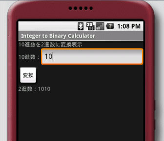

試しに下図のような簡素な10進2進変換アプリを作ってみました。 [](./android_itbcalc.gif) 以下は書いてみたコード。

## ソースコード

### res/values/strings.xml


```xml
 Integer to Binary Calculator 10進数を2進数に変換表示 10進数： 2進数： 変換 
```


### res/layout/main.xml


```xml
 
```


### ITBCalculatorActivity.java


```java
 package info.yukun.android.itbcalc; import android.app.Activity; import android.os.Bundle; import android.view.View; import android.widget.Button; import android.widget.EditText; import android.widget.TextView; public class ITBCalculatorActivity extends Activity { /** Called when the activity is first created. */ @Override public void onCreate(Bundle savedInstanceState) { // アクティビティが生成される際に必ず呼び出される super.onCreate(savedInstanceState); setContentView(R.layout.main); // UIのレイアウトを設定 // 指定したリソース(R.java)インデックスからビュー(res/layout/main.xml)内のidのコンポーネント(ここではButton)インスタンスを取得 Button button = (Button) findViewById(R.id.button_convert); button.setOnClickListener(convertToBinary); // ボタンが押された際のイベントを登録 } // 登録するイベントリスナーはView.OnClickListenerを実装 private View.OnClickListener convertToBinary = new View.OnClickListener() { public void onClick(View view) { // ボタンが押されたときに呼び出されるメソッド EditText textInteger = (EditText) findViewById(R.id.text_integer); // 入力値が入っているコンポーネントを取得 String input = textInteger.getText().toString(); if (input.equals("")) return; int intValue = Integer.parseInt(input); String binValue = Integer.toBinaryString(intValue); // 10進数整数を2進数文字列に変換 TextView labelResult = (TextView) findViewById(R.id.label_result); // 結果を表示するTextViewを取得 labelResult.setText("2進数：" + binValue); } }; } 
```


## Androidアプリを書いてみて

EditText android:id="@+id/text\_integer"の属性android:maxLengthを"9"としたのは、変換メソッドInteger.toBinaryString(int value)の引数が32bit整数の為です。本当は属性値を10としてonClickメソッド内で32bitの範囲内(-2 147 483 647 ～ 2 147 483 647 = (2^31) - 1)か否かを判定したほうが良いと思うのですが、今回は端折りました。 ビジュアルエディタやXMLでUIのレイアウトを作っていくというのはFlexのmxmlに似てて取っ掛かり易い感じです。
