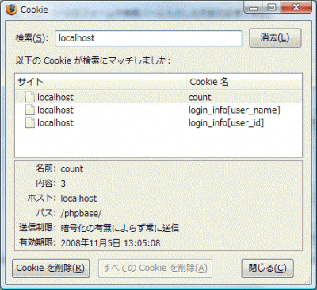

クライアントのブラウザにCookieを保存・削除する手順の練習をしてみました。 Cookieはサーバからクライアントへレスポンスを送信する際にヘッダに含まれる情報で、Cookie受信以降のクライアントのリクエストにはCookieの情報が含まれます。これによって、クライアントの識別や状態を管理することが出来ます。 Cookieをクライアントに送信する際は有効期限を設定し、削除する際はその有効期限を過去のものとして期限オーバーを装い、ブラウザに削除させます。 具体的に以下の例では、setcookie(＜cookie名＞\[, ＜値＞\[, ＜有効期限＞\[, ＜送信パス＞\[, ＜送信ドメイン＞\[, ＜httpsのときのみの送信?＞\]\]\]\]\])でCookieを設定、削除します。cookie名には変数の他に配列も使用することが出来ます。

## ソースコード

Cookieを用いたクライアントへの情報の保存とアクセスのカウント例です。クライアントブラウザ側からのリクエストに含まれるCookieへのアクセスには配列$\_COOKIEを用います。 

```php
  クッキーの利用と削除 \n"; //echo $_COOKIE['login_info']['user_name'];などでアクセスしてもよい foreach ($_COOKIE['login_info'] as $key => $value) { echo $key . " → " . $value . "  
\n"; } } else { echo "ユーザ情報のクッキーが保存されていません（初回読み込み時) or 削除されました）。  
\n"; } echo $count . "回目のアクセスです。  
\n"; ?> 
```


## 実行結果

### 1回目のアクセス

```
ユーザ情報のクッキーが保存されていません（初回読み込み時) or 削除されました）。
1回目のアクセスです。

```

### 2回目以降のアクセス(偶数回)

```
ユーザ情報のクッキーがセットされています。
user_id → 59816
user_name → yukun
2回目のアクセスです。

```

### 3回目以降のアクセス(奇数回)

```
ユーザ情報のクッキーが保存されていません（初回読み込み時) or 削除されました）。
3回目のアクセスです。

```

このときのCookieの保持状況をブラウザで確認してみると、 [](./firefox_show_cookie01-e1273383447412.gif) 確かに保存されていますね。次のアクセスの際、これを読み込み以下の項目を表示しますが、

```
user_id → 59816
user_name → yukun
```

直後に削除されます。 Cookieはクライアントを識別するのに便利な機能ですが、これは改ざんされる恐れもありセキュリティに注意して扱わなければなりません。なので、上の例のような分かりやすい配列名で重要なデータ（例えばパスワードなども）を扱うのも好ましくないようです。

## クッキーを扱う際の注意点

- ブラウザの設定によってはCookieをうけつけない。
- 1つのCookieのサイズは最大4KBまで
- 1つのドメインでは最大20個まで
- Cookieの有効期限の判定はクライアントの時計に従う
