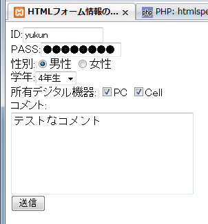
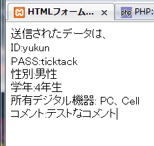

HTMLフォームの情報をPOSTメソッドで送信し、送信されたデータをPHPスクリプトで取得しHTMLに埋め込み表示してみます。フォームの各フィールドははformタグ中でinput、select、textareaタグ等を用いて指定します。特にinputタグは下表の様にtype属性が色々あります。

| inputタイプ | type属性 |
| --- | --- |
| テキスト入力 | type="text" |
| パスワード入力 | type="password" |
| ラジオボタン | type="radio" |
| チェックボックス | type="checkbox" |
| 送信ボタン | type="submit" |
| ボタン | type="buttun" |

フォームデータの送信先はformタグのaction属性で指定します。また、そのときのリクエストメソッドの指定はformタグのmethod属性で指定し、ここではPOSTを用いるのでmethod="post"と記述します。POSTはGETメソッドと異なり特に文字制限はありません。

## ソースコード

### form\_test.html


```html
  HTMLフォーム情報の送信テスト

ID:  
PASS:  
性別:男性 女性  
学年: 1年生 2年生 3年生 4年生  
所有デジタル機器: PC Cell  
コメント:  
  
```

 フォームデータは同ディレクトリに設置したshow\_form\_data.phpファイルに送信しています。

### show\_form\_data.php


```php
 $value) { $have_dig[$key] = $value; } } $comment = htmlspecialchars($_POST["comment"], ENT_QUOTES); } else { echo "フォームページからアクセスしてください。"; exit(1); } ?>  HTMLフォームのPOSTの受信テスト 送信されたデータは、  
ID:  
PASS:  
性別:  
学年:年生  
所有デジタル機器:  
コメント:  
```

 POSTリクエストでshow\_form\_data.phpへアクセスした場合はexit関数でスクリプトを終了します（→[PHP: exit - Manual](http://jp.php.net/manual/ja/function.exit.php "PHP: exit - Manual")）。 htmlspecialchars関数で特殊文字をエスケープします（→[PHP: htmlspecialchars - Manual](http://jp.php.net/htmlspecialchars "PHP: htmlspecialchars - Manual")）。今回はPOSTメソッドに関する練習用スクリプトなのでバリデーション処理は入れていませんが、実際はセキュリティ対策と合わせて色々フィルタするなり、リダイレクトで別ページに誘導するなりの処理が必要です。最近はこの辺の処理をフレームワークで上手くラップしてくれるのでかなり楽になっています。 あと、余談ですがforeach文では操作対象の配列のコピーを作成して、コピーに対して処理していきます。

## 実行結果

### form\_test.html

[](./form_test_html.gif)

### show\_form\_data.php

[](./show_form_data_php.gif)
