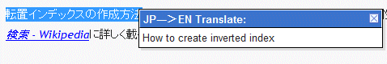

↓使用時の図  先日JavaScriptを学び始めてみたので、手始めにこのブログに翻訳スクリプトを付けてました。この機能は単一記事ページ上でテキストをドラッグするとマウスの近くに英訳が表示されます。まぁ自動翻訳の性能は・・・f^^;一応スクリプトのロードを計測したら、たいして時間と負荷がかからないようなのでしばらく様子みて、また私の学習度合いに合わせてUIを改良してみます。設置の動機は最近なぜか海外からのアクセスが増えてきているから。 **追記**：　Google Chromeでは使えないみたいです。原因究明中です。 **追記2**：　使ってみて案外煩わしいので取り外します＞＿＜
