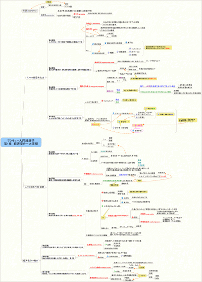

<iframe src="http://rcm-jp.amazon.co.jp/e/cm?t=ref22-22&amp;o=9&amp;p=8&amp;l=as1&amp;asins=4492313869&amp;md=1X69VDGQCMF7Z30FM082&amp;fc1=232323&amp;IS2=1&amp;lt1=_blank&amp;m=amazon&amp;lc1=0000FF&amp;bc1=F8F8F8&amp;bg1=F8F8F8&amp;f=ifr" style="width:120px;height:240px;" scrolling="no" marginwidth="0" marginheight="0" frameborder="0"></iframe>

最近マンキュー入門経済学を読み始めましたので復習を兼ねてMindMapを作成してみました。以下のイメージをクリックすると拡大表示します。  章末の復習問題は後日追記したいと思います(気長に)。
