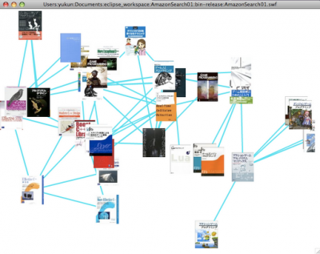

タイトルは反語として読む。  Demo(Uncompleted): ※追記：2011年現在Amazonのサービス仕様の変更により上記のリンク先アプリは正常に動作しません<(\_ \_)>

これは何？

Amazon.co.jpの任意の商品の類似商品を線で結び関連付けを視覚化するアプリ。（見にくいね。まだ未完成だけど、暇を狙って完成させる）

どうやって使うの？

1. 商品画像をダブルクリックすると類似商品の画像が表示されます。またその画像をダブルクリックすると・・・以下ループ。
2. 画像をドラッグすると線で結ばれた類似商品も納豆の糸のようについてきます。

今後直したい／追加したい機能は？

1. 商品の検索フォーム
2. 商品-類似商品間の距離調整だけでなく類似-類似間の調整も行う
3. 各イベントによる処理のタイミングの調整
4. ドラッグ中の商品とその関連商品を結ぶ線の色と画像のサイズを変更
    - 関連の深さによって色合いとサイズが変化
5. 商品をクリック／マウスオーバーしたときのアクションを増やす
    - タイトル等の商品の詳細情報を表示
    - Amazonページへのリンク
6. 関連度合いによるエフェクトの区別
7. 3D表示：Z軸への意味付け（時間軸、ここでは出版年度なんかは最適かも？）

それができたら使うメリットはある？

たぶん色々とある。作る前から作るべき明確なメリットを定義して作り始めるのがベターというかマストだけど。どちらにせよ仮説と検証の試行錯誤は必要。

そういえば、なんで作ろうと思ったの？

以前授業の課題で書いたX11でフラクタル描くコードと卒研のコードを読み直していたら今回のアプリを想像して「ん？これくらいならサクッと書けるかも」と思ったのが発端。また、「検索行動の典型」＝「フォームにキーワードをスペースはさんで入力→ポチっ→ページのリストから選択」とはひと味変った検索のメリットを見出したい、というのがメタ動機。その一例（にできればいいね）。

作って勉強になったことは？

一応作ることで、以前よりクラスの役割付け（機能の結合度合い）とデザパタの適応を以前よりスムーズにこなせるようにはなった。おおまかな設計→コーディングの速度も少し上がった（気のせい）。でもそれ以外は・・・うーん、今後の課題。 今回はAmazonの商品を線で繋げたけれど、それをTwitter(つぶやき-つぶやき中のキーワード間、ユーザ-フレンド間)やDelicious(タグ-ブックマーク間、ユーザ-フレンド間)、WordPressブログ（タグ-記事間）に変更しても基本UIの部分はわずかな修正でいけるクラス群だと思う。もちろん、場合によっては類似度を算出する部分も用意する必要がある。

最近ブログ書いてないね。

卒研とバイトその他で詰まっているのは理由としては身も蓋もナフサ。単に私の生活の中でブログのプライオリティや使い道が変化してきているのかも。
