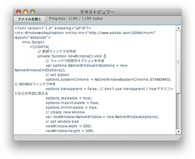

[](./ReadTxtFile01_result-e1273382664744.png) AIRコンポーネントではローカルのファイルにアクセスすることができます。下記のコードは日本語を含むマルチバイトのテキストファイルを読み込み、画面い表示する処理を行う。 
<!-- truncate -->


## 大まかな手順

1. FileStreamのコンストラクタの引数に対象のファイルへのパスが設定されたFileインスタンスを渡す。
2. FileStream#openAsyncで実ファイルへのパイプ接続。
3. この時、非同期の読み込み完了／エラーを取得するためにイベントを登録しておく。
4. 実際の文字の読み取り（どれだけ読むか、文字コードの変換など）はFileStream#readMultiByteで行う。
5. ストリームのインスタンスには接続時にpositionプロパティ（何処読んでいるかのポインタみたいなもの）からファイル末尾までのサイズ（bytesAvailable）を取得してるので、読み込みサイズにそれを指定。
6. FileStream#close()でストリームを閉じる

### ソースコード


```actionscript
 
```


### リファレンス

- Adobe AIR 1.5 \* ファイルの読み取りと書き込みのワークフロー
- Adobe AIR 1.5 \* 読み取りバッファと FileStream オブジェクトの bytesAvailable プロパティ
