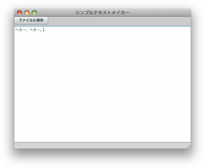

[](./WriteTxtFile01_result-e1273382752288.png) AIRコンポーネントではローカルのファイルにアクセスすることができます。下記のコードは日本語を含むマルチバイトの文字列をテキストファイルに書き込む処理をする。 
<!-- truncate -->


## 処理の手順

1. FileStream#openAsync()かopen()メソッドの引数にFileインスタンスとFileModeのプロパティを設定して実ファイルのパイプに接続
2. FileStream#writeMultiByte()でファイルに書き込み
3. FileStream#close()でストリームを閉じる

### ソースコード


```actionscript
 
```


### リファレンス

- Adobe AIR 1.5 \* ファイルシステムの操作
- Adobe AIR 1.5 \* ファイルの読み取りと書き込み
