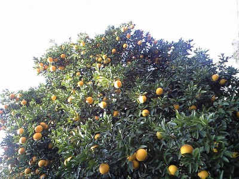
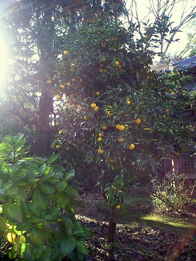

 先日、親戚の所へお歳暮持参で年末の挨拶に行ってきたけど、皆元気そうでなりよりでした。また、私も彼らに元気な様子といい話を伝えられて良かった。たまにしか会えないので再会の喜びはひとしお。しばらくおしゃべりした後はコタツでまたーりしてました。午後から暖かくなってきたので庭を散策していたら、ぽつんと実をつけたゆずの木↓があったので丁度冬至ということもあり数個頂きました。  帰路の途中、高校の先輩から忘年会のお誘いがあったので飛び入り参加させてもらいました。席の隣になった方が大学時代にコンピュータ・サイエンスを学んでいたので、その時の研究内容を具体例を交えて分かりやすく説明して頂いたのですが、私の英語力がまだまだ足りないばっかりにうまく話を膨らますことができませんでした。それがもったいなかったので今後は英語学習の割合を増やして他を減らし、使う機会も積極的に設けていこう。
