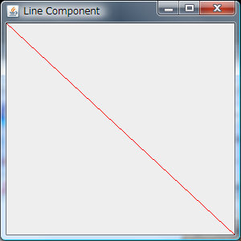

JComponentはほとんど全てのSwing コンポーネントの基底クラスで、Graphicsオブジェクトも持っています。下記のソースは、そのGraphicsを用いて画面に直線を描画するものです。

## ソースコード


```java
package linecomp;
import java.awt.Color;
import java.awt.Graphics;
import java.awt.Insets;
import javax.swing.JComponent;
import javax.swing.JFrame;
import javax.swing.SwingUtilities;
public class LineComp extends JComponent {
  public static void main(String[] args) {
    Runnable myGUI = new Runnable() {
      @Override
      public void run() {
        JFrame win = new JFrame("Line Component");
        win.setDefaultCloseOperation(JFrame.EXIT_ON_CLOSE);
        Insets ins = win.getInsets();
        win.setSize(300 + ins.left + ins.right, 300 + ins.top + ins.bottom);
        win.add(new LineComp());
        win.setVisible(true);
      }
    };
    SwingUtilities.invokeLater(myGUI); // 保留中のすべての AWT イベントが処理されたあとに発生
  }
  @Override
  public void paintComponent(Graphics g) {
    g.setColor(getBackground());
    g.fillRect(0, 0, getWidth(), getHeight());
    g.setColor(Color.RED);
    g.drawLine(0, 0, getWidth(), getHeight());
  }
}
```

 GUI部品の(再)描画レンダリングが発生した際、オーバーライドしたpaintComponent()内の手続きをEventQueueに登録しEDT(Event Dispatch Thread)が処理をします。標準のGUI部品をカスタマイズしたい場合などに使えます。その場合は予めsuper.paintComponent(g);でデフォルトのレンダリングを基底クラスに任せ、その後にカスタムの描画処理を書きます。

## 実行結果

[](./line_component.jpg)

### 追記: d\_kami さんに改良して頂きました

> InsetとJFrame#setSizeを使わずにJComponent#setPreferredSizeとJFrame#packを使うようにした - [他のやり方 - マイペースなプログラミング日記](http://d.hatena.ne.jp/d-kami/20090222/1235274347 "他のやり方 - マイペースなプログラミング日記")

```
comp.setPreferredSize(new Dimension(300, 300));
win.add(comp);
win.pack();

```

確かにsetPreferredSizeでコンポーネントのサイズを直接指定したほうが今プログラムの文脈に沿っています。私のほうはコンポーネントでなくJFrameのサイズの指定ですから。また、オーバーライドしたpaintComponent()でgetWidth()やgetHeight()を二度使うのであれば、一度ローカル変数に格納することでオーバヘッドを下げるのも大切ですね。日頃からの習慣にしないと。 とても勉強になりました。ありがとうございます。

### 参考サイト

- [JComponent (Java Platform SE 6)](http://docs.oracle.com/javase/7/docs/api/javax/swing/JComponent.html "JComponent (Java Platform SE 6)")
- [SwingUtilities (Java Platform SE 6)](http://docs.oracle.com/javase/jp/6/api/javax/swing/SwingUtilities.html "SwingUtilities (Java Platform SE 6)")
