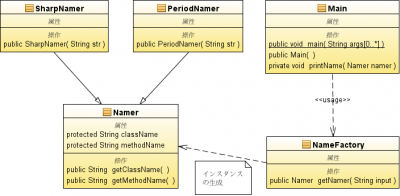

以前デザインパターンの理解の確認がてら簡単なコードを書いた。リファクタリングの前後を省いているので初見ではパターンのメリットと適応基準が見えにくく、またサンプルのテーマ設定が良くなかったので少々説明し難い。今回のようなToyコードみたいなのはたまに書く。

## クラス図

[](./simple_factory_classes-e1271583536302.png) 文字列の分割プログラム。 入力: クラス名＋＜区切り文字＞＋メソッド名の文字列 出力: その文字列の分割結果が格納されたインスタンス（Namerクラス）。 文字列の形式が"＜クラス名＞#＜メソッド名＞"か"＜クラス名＞.＜メソッド名＞"によって、すなわち区切り文字によって分割処理のメソッドの内容が変わるので、その違いを派生クラスでオーバーライドして定義したメソッドで吸収しようというもの。 これによる利点はMain側が分割対象の文字列の形式を意識しなくてよいこと。単にNameFactory#getNamer()に渡すだけ。文字列の形式が2つの内のどちらで、どのクラスに処理を任せるかの処理はgetNamer()が行う。これによって、仮に文字列の形式を増やす場合に修正するのはgetNamer()のifブロック、追加するのは新しい派生クラス。 
<!-- truncate -->


## ソースコード


```java
 public class Main { public static void main(String[] args) { new Main(); } public Main() { NameFactory nameFactory = new NameFactory(); Namer namer; namer = nameFactory.getNamer("String#indexOf()"); printName(namer); namer = nameFactory.getNamer("ArrayList.get()"); printName(namer); namer = nameFactory.getNamer("Thread#run()"); printName(namer); } private void printName(Namer namer) { System.out.println("Class Name: " + namer.className); System.out.println("Method Name: " + namer.methodName); } } public class NameFactory { // 区切り文字の種類によって、処理する派生クラスを決める public Namer getNamer(String input) { if (input.indexOf(".") > 0) return new PeriodNamer(input); else if (input.indexOf("#") > 0) return new SharpNamer(input); return null; } } public class Namer { protected String className; protected String methodName; public String getClassName() { return className; } public String getMethodName() { return methodName; } } public class SharpNamer extends Namer { // 「#」で名前を区切る public SharpNamer(String str) { int i = str.lastIndexOf("#"); if (i > 0) { className = str.substring(0, i); // (beginIndex, endIndex) methodName = str.substring(i + 1); // (beginIndex) } else { className = ""; methodName = str; } } } public class PeriodNamer extends Namer { // 「.」で名前を区切る public PeriodNamer(String str) { int i = str.lastIndexOf("."); if (i > 0) { className = str.substring(0, i); // (beginIndex, endIndex) methodName = str.substring(i + 1); // (beginIndex) } else { className = ""; methodName = str; } } } 
```


## 実行結果

```
Class  Name: String
Method Name: indexOf()
Class  Name: ArrayList
Method Name: get()
Class  Name: Thread
Method Name: run()

```

書いた後ふと考えたのですが、これ100形式だと100派生クラスで、if-elseブロックもえらいことになるなぁ。こういう時、現時点では思考停止してしまうので、今月の課題。 今後はなるべく制作中のアプリの中での問題かそれに関わるもの、絡められるものを取り上げていきたい。
