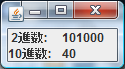
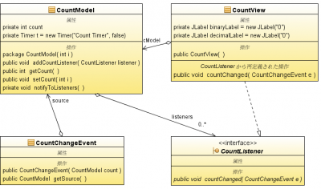
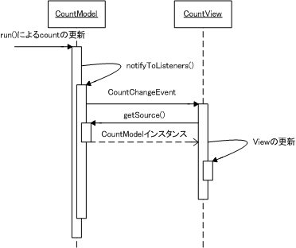

よくGUIやWebアプリの簡単なサンプルソースなどは、UIとアプリケーションのロジックが同じクラスまたはメソッドに書かれている場合が多い。それはそのサンプルがある特定の機能や関数の紹介の為に簡潔に書いているのだが、仮にいざそのソースを元にアプリを作りこんで機能の追加を行っていくとUIとアプリのロジックは分離したほうが保守・拡張と共に行い易い。 下記のプログラムは1秒毎に数値をカウントし、それを2進数と10進数でGUI上のラベルに出力する機能をモデルとビューに分けている。すなわち、数値のカウントをするモデルと数値をUIに表示するビューに。（いくつかの言語ではGUIの部品として[タイマーがある](/blog/csharp-timer)ようだが。。） 
<!-- truncate -->


## 実行結果

[](./count_timer01.png)

## クラス図

[](./countmodel_view_class-e1271583675800.png) インスタンスの生成はコンストラクタで行うのがいいのですが、はしょっている。さて、これまでに何らかのフレームワークを使っていた方には上クラス図はMVCの説明図として見慣れているかもしれない。今回ModelとViewを繋ぐControllerの役割はCountListenerが担っている（下記コードではCountChangeEvent経由でModelインスタンスを渡すのみだが）。

### 処理手順

ビュー側で自身のインスタンスをモデルに登録し（モデル.addCountListener(ビュー)）、モデルのデータが更新された場合、モデル→ビューへイベントを送出。イベント内部にモデルのデータがあり、そのデータでビューがUIを更新する。イベントの発生順序等は下図のシーケンス図のようになる。

## シーケンス図

[](./countmodel_view_sequence.png)

### 無限ループに注意

ビューを更新するイベントリスナーのメソッド（ここではcountChanged()）で再度モデルのプロパティ変更メソッド（ここではsetCount()）を用いると、再度イベント通知処理（notifyToListeners()）が発生することで、無限ループになるので注意が必要。

### ビューの追加手順

ビューを追加する際の手順は、ビューのインスタンスをモデルのリスナーに登録し（addCountListener()）、ビュー自身がリスナーのメソッドを実装することで（countChanged()）、モデルからのイベントを受け取ることが出来る。 そういえば最近はIDEの方でバインド設定したり、ObservableList等があるのであまり意識することがなくなってきたなぁ。

## ソースコード


```java
 import java.awt.Container; import java.awt.GridLayout; import javax.swing.JFrame; import javax.swing.JLabel; class CountView extends JFrame implements CountListener{ private final JLabel binaryLabel = new JLabel("0"); private final JLabel decimalLabel = new JLabel("0"); private CountModel cModel = new CountModel(0); public static void main(String[] args) { new CountView(); } public CountView() { super("Counter"); Container c = getContentPane(); c.setLayout(new GridLayout(2, 2)); c.add(new JLabel(" 2進数:")); c.add(binaryLabel); c.add(new JLabel("10進数:")); c.add(decimalLabel); setDefaultCloseOperation(JFrame.EXIT_ON_CLOSE); cModel.addCountListener(this); // ModelにViewを登録 pack(); setVisible(true); } public void countChanged(CountChangeEvent e) { if (e.getSource() == cModel) { binaryLabel.setText(Integer.toString(cModel.getCount(), 2)); decimalLabel.setText(Integer.toString(cModel.getCount(), 10)); } } } 
```

 

```java
 import java.util.ArrayList; import java.util.List; import java.util.Timer; import java.util.TimerTask; /** * カウントするModel */ public class CountModel { private int count; private final List listeners = new ArrayList(); private Timer t = new Timer("Count Timer", false); CountModel(int i) { count = i; t.scheduleAtFixedRate(new CountTime(), 0, 1000); } // Viewを登録 public void addCountListener(CountListener listener) { listeners.add(listener); } public int getCount() { return count; } public void setCount(int i) { count = i; notifyToListeners(); } // Viewへの通知 private void notifyToListeners() { for (CountListener listener : listeners) { listener.countChanged(new CountChangeEvent(this)); } } class CountTime extends TimerTask { @Override public void run() { setCount(getCount() + 1); } } } 
```

 

```java
 /** * View側で実装する(Model側から呼び出し) */ public interface CountListener { public void countChanged(CountChangeEvent e); } /** * 通知内容を表すイベント(Modelが生成しViewが受け取る) */ public class CountChangeEvent { private final CountModel source; public CountChangeEvent(CountModel count) { this.source = count; } public CountModel getSource() { return source; } } 
```


