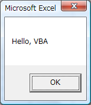
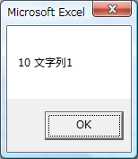
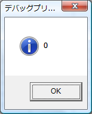
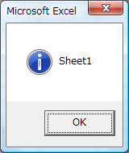

ポツポツ使う場面が増えてきたので、備忘録代わりにまとめていこうかな（気が向いたときに）。

## VBAでHello World

メニューバーからツール→マクロ→Visual Basic Editor(Alt+F11)をクリックするとエディタが起動します。最初は何もファイルが開かれていないと思うので、まず、メニューバーから挿入→標準モジュールをクリックして新規作成し、試しに以下のコードを打ち込んで実行してみます。 

```vb
 Sub helloWorld() MsgBox "Hello, VBA" End Sub 
```

 入力し終わったらメニューの実行→Sub/ユーザー フォームの実行(F5)をクリックするとスクリプトが実行されます。結果は下図のようになります。 [](./vba_hello_world.png) ダイアログボックス内に文字列が表示されていますね。仮に下記のようにした場合は、 

```vb
 Sub helloWorld() MsgBox "Hello, VBA" MsgBox "Hello, Excel" End Sub 
```

 一つ目の"Hello, VBA"のダイアログのOKを押した後、"Hello, Excel"のダイアログが表示されます。どうやらMsgBox関数はブロック関数みたい。

## 変数の宣言 - Dim


```vb
 Sub varTest() Dim num1 As Integer Dim str1 As String Dim num2 As Integer, str2 As String num1 = 10 str1 = "文字列1" MsgBox num1 & " " & str1 MsgBox num2 & " " & str2, vbInformation, "デバッグプリント" End Sub 
```

 実行結果は [](./vba_var01.png) [](./vba_var02.png) 変数宣言の一般式は

> Dim ＜変数名＞ As ＜型＞

のようにDim～Asステートメントを用います。 また、MsgBox関数のvbinformationを指定することで情報メッセージアイコンを表示します。ちなみに、出力する複数の文字列の連結は「**&**」を用います。

## 定数の宣言 - Const

> Const ＜定数名＞ As ＜型＞ = ＜値＞

変数宣言と似てますね。異なるところは、DimがConstに変わり、宣言と値の初期化を同時に行うことですかね。変数も値の初期化は可能ですが、それは任意です。

## オブジェクトの参照を変数に格納 - Set

オブジェクトの参照を代入する際にはSetステートメントを使用します。以下のコードは1つ目のワークシート名を表示しています。 

```vb
 Sub objectTest() Dim tmpSheet As Worksheet Set tmpSheet = Worksheets(1) MsgBox tmpSheet.Name, vbInformation End Sub 
```

 実行結果は [](./vba_var_set01.png) 一般式は

> Set ＜オブジェクト型変数＞ = ＜オブジェクト＞

### コンパイルエラー、「SubまたはFunctionが定義されていません」の原因

大抵ミスタイプです。Worksheet**s**(1)と打つところをWorksheet(1)としてしまうとか。変数宣言のミスでもデフォルトでは「SubまたはFunctionが～」と出力されるので注意。

## 配列の宣言

> Dim ＜配列名＞(＜要素数＞) As ＜型＞


```vb
 Sub objectTest() Dim arr(3) As Integer arr(0) = 99 MsgBox arr(0) End Sub 
```

 ダイアログには99が表示されます。配列の添え字は0から数えますが、下記の文をモジュールの宣言セクションに書くことで1から数えられます。

> Option Base 1


```vb
 Option Base 1 Sub objectTest() Dim arr(3) As Integer arr(1) = 99 MsgBox arr(1) End Sub 
```

 実行結果は同じく99です。
