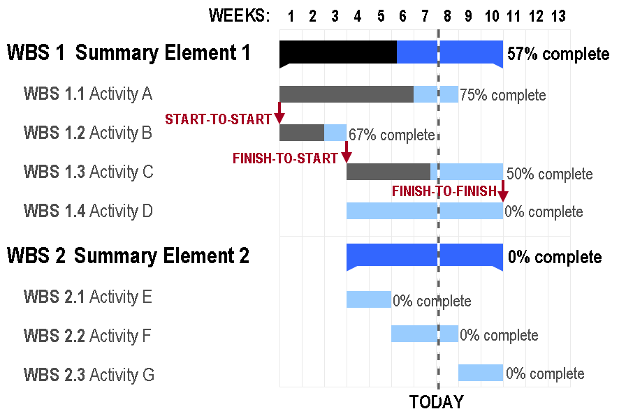

1\. 主なデータの管理・取り出し方法

1. LIFO (Last-In First-Out): キューなどに使われる。
2. FIFO (First-In First-Out): スタック。再帰的な処理をする際、実行中の状態を保存しておく為にも使われる。
3. LFU (Least **F**requently Used): 参照頻度が最も少ないものを取り出す。
4. LRU (Least **R**ecently Used): 未使用時間が最も長いものを取り出す。

<!-- truncate -->
 2. 多態性 (**Poly**morphism ⇔ Mono-morphism: 単態性) : **同じ名前**のクラス(型変数)でも格納されているインスタンスによって**違う振る舞い**をすること。Java記述言語仕様で具体的に実現する場合は、以下の3通りが考えられる。

1. 抽象メソッドAが定義されたインターフェイスを実装した二つのクラスは、そのインターフェイス型の変数にインスタンスを格納し、それぞれ実装されたメソッドAを実行すること。
2. 基底クラスIのメソッドBを派生クラスJでオーバーライドし、基底クラス型の変数に派生クラス型のインスタンスを格納し、IのメソッドB経由でJでオーバーライドされたメソッドを実行すること。
3. ↑のを抽象クラスに置き換えても可。

例：　[Simple Factory - インスタンスの生成方法を任せる - Yukun's Blog](/blog/java-design-pattern-simple-factory "Java, デザインパターン: Simple Factory - インスタンスの生成方法を任せる - Yukun's Blog") 3. OSI (Open Source Initiative)はOpen Sourse の定義としてOSD (Open Source Definition)を定めている。派生著作物に元のソフトウェアとは異なる名前やバージョンをつけるように要請することができる。

> オープンソースの定義 ([http://www.opensource.jp/osd/osd-japanese.html](http://www.opensource.jp/osd/osd-japanese.html))
> 
> 1. 再頒布の自由
> 2. ソースコード（を含んでいなければならない）
> 3. 派生ソフトウェア（を元のソフトウェアと同じライセンスで頒布することを許可しなければならない）
> 4. 作者のソースコードの完全性(integrity)
> 5. 個人やグループに対する差別の禁止
> 6. 利用する分野に対する差別の禁止
> 7. ライセンスの分配
> 8. 特定製品でのみ有効なライセンスの禁止
> 9. 他のソフトウェアを制限するライセンスの禁止
> 10. ライセンスは技術中立的でなければならない。

4\. 主なシステム開発手法

- _ウォータフォールモデル_: 上流→下流工程順。進捗管理と資源分配は簡単だが、工程の後戻りと仕様変更が困難。頻繁に後戻りが発生する欠点もあり。
- _エボリューショナルモデル_: 最初にシステム全体のプロトタイプモデルを作成して、それをバージョンアップさせていくモデル。レビューと仕様変更は容易だが進捗管理が困難。
- _スパイラルモデル_: ウォータフォールモデルとエボリューショナルモデルを融合したモデル。システムをいつかに分割し、その部分ごとに設計→プロトタイプ作成→評価を繰り返す。仕様変更はしやすい。
- _インクリメンタルモデル_: 共同開発可能でかつ独立したサブシステムに機能を分割し、それぞれを同時に開発、段階的にリリースしていく。利点は全ての機能がそろっていなくても最初のリリースから**システム全体の動作を確認**できる。

5\. DFD (Data Flow Diagram)で用いられる図形要素は、データの源泉（と吸収)、プロセス、データストア、データフローなどがある。ERD (Entity Relationship Diagram: E-R図)は関連、実態、属性などがある。 参考: [データフロー図 - Wikipedia](http://ja.wikipedia.org/wiki/%E3%83%87%E3%83%BC%E3%82%BF%E3%83%95%E3%83%AD%E3%83%BC%E3%83%80%E3%82%A4%E3%82%A2%E3%82%B0%E3%83%A9%E3%83%A0 "データフロー図 - Wikipedia")、[実体関連モデル - Wikipedia](http://ja.wikipedia.org/wiki/%E5%AE%9F%E4%BD%93%E9%96%A2%E9%80%A3%E3%83%A2%E3%83%87%E3%83%AB "実体関連モデル - Wikipedia") 6. ホワイトボックステストでの4つの網羅

1. 命令網羅
2. 判定条件網羅
3. 分岐網羅
4. 複数条件網羅

7\. _多重プログラミング_では**演算処理が中心**のプログラム同士だと、CPUの使用率が上がるためシステム全体の**スループットは低下**する。 8. ある作業工程Aの**最遅開始日**はクリティカルパスから工程Aの所要日数分だけ前倒しした日程である。それ以降は全体の日程に影響を与える（クリティカルパス自体が伸びる）。 9. ガントチャートは縦軸：人員、作業内容で横軸：時間の図で、工程管理に用いられる。各作業の開始・終了納期や進捗状況の把握が容易。しかし、作業の遅延による影響はわかりずらく、将来の予測も立て難い。作業の相互関係やマイルストーンの把握には向かない。  参考：[ガントチャート - Wikipedia](http://ja.wikipedia.org/wiki/%E3%82%AC%E3%83%B3%E3%83%88%E3%83%81%E3%83%A3%E3%83%BC%E3%83%88 "ガントチャート - Wikipedia")
