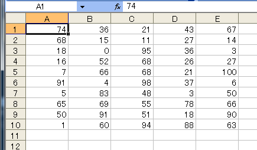

[](./excel_vba_random_cells.png) 今回のネタは乱数でサンプルデータを生成したいときなどに使えますかね。

## ソースコード


```vb
Sub randloop()
    Randomize ' シードの設定（引数省略でシステムタイマーの値）
    Const GYO_S As Integer = 1 ' 開始行
    Const RETSU_S As Integer = 1 ' 開始列
    Const GYO_E As Integer = 10 ' 終了行
    Const RETSU_E As Integer = 5 ' 終了列
    Const UPPER As Integer = 100 ' 乱数の最大値
    Const LOWER As Integer = 0 ' 乱数の最小値
    ' 指定された行、列のテーブル内のセルに乱数を格納
    For i = GYO_S To GYO_E
        For j = RETSU_S To RETSU_E
            ' Rndは[0, 1)の範囲の値を返す
            Cells(i, j).Value = Int((UPPER - LOWER + 1) * Rnd + LOWER)
        Next j
    Next i
End Sub
```

 実行結果は上図のように0～100の範囲の乱数（今回は整数）が格納されます。 上記のコードの要の式は

```
(upper - lower + 1) * Rnd + lower
```

です。簡単に意味を説明しますと括弧内の+1はRndの戻り値の範囲が1未満の為の補正で、式の最後の+lowerはRndの戻りが0の場合の補正、と捉えます。

### 参考サイト

- VBA World ： 乱数の発生(関数：Rnd) その１
