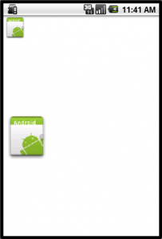

[](./android_image_sample01.png)

表示する画像はEclipse上でAndroidプロジェクト作成時に自動的に作成されるIcon画像です。 画像パス：_プロジェクト名_/res/drawable-hdpi/icon.png resフォルダ以下に置かれたリソースはコンパイル時にプログラムに組み込まれます。その画像リソースを読み込む際は、

```
Bitmap BitmapFactory.decodeResource(Resources r, int resourcesID)

```

を用います。読み込んだBitmapインスタンスを描画するには、Canvasクラスのインスタンスメソッドである

```
void drawBitmap(Bitmap image, int x, int y, Paint p)

```

を使います。なお、拡大・縮小する場合も上記のdrawBitmapをオーバーロードしたものを使います。

```
void drawBitmap(Bitmap image, Rect src, Rect dst, Paint p)

```

今回のサンプルプログラムでは、元画像の幅と高さを2倍したイメージを描画しています。

### ImageSp.java


```java
package info.yukun.imagesp;
import android.app.Activity;
import android.os.Bundle;
import android.view.Window;
public class ImageSp extends Activity {
	/** Called when the activity is first created. */
	@Override
	public void onCreate(Bundle savedInstanceState) {
		super.onCreate(savedInstanceState);
		requestWindowFeature(Window.FEATURE_NO_TITLE);
		setContentView(new ImageView(this));
	}
}
```


### ImageView.java


```java
package info.yukun.imagesp;
import android.content.Context;
import android.content.res.Resources;
import android.graphics.Bitmap;
import android.graphics.BitmapFactory;
import android.graphics.Canvas;
import android.graphics.Color;
import android.graphics.Rect;
import android.view.View;
public class ImageView extends View {
	private Bitmap image;
	public ImageView(Context context) {
		super(context);
		setBackgroundColor(Color.WHITE);
		// リソースの画像ファイルの読み込み
		Resources r = context.getResources();
		image = BitmapFactory.decodeResource(r, R.drawable.icon);
	}
	@Override
	protected void onDraw(Canvas canvas) {
		// イメージ描画
		canvas.drawBitmap(image, 0, 0, null);
		int w = image.getWidth();
		int h = image.getHeight();
		// 描画元の矩形イメージ
		Rect src = new Rect(0, 0, w, h);
		// 描画先の矩形イメージ
		Rect dst = new Rect(0, 200, w*2, 200 + h*2);
		canvas.drawBitmap(image, src, dst, null);
	}
}
```


