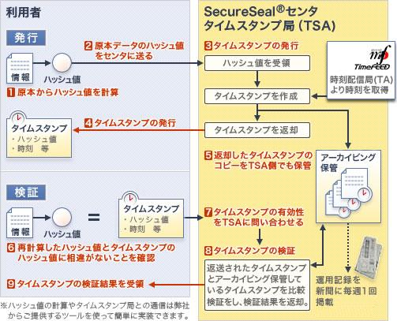

タイムスタンプ署名の生成と検証のわかりやすいフローがあったので紹介。  タイムスタンプサービスSecureSealの仕組み-SecureSeal:NTTデータ タイムスタンプ署名されたデータから利用者が確認できる情報は、データのコード署名が行われた日時。

### 図の説明

利用者がタイムスタンプトークンをデータと一緒に取得した後、TSAの公開鍵を用いてタイムスタンプトークンを複合(7)。複合するとハッシュ値(メッセージダイジェスト)+日時(コード署名が行われた日時)を取得できるので、ここで取得できた**ハッシュ値と**、取得したデータから算出した**ハッシュ値を比較**し改ざんやなりすましがされていないかを確認(8)。
