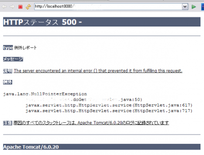

### 事象 - NullPointerException on java.sql.Connection

JDBCを用いてServletからMySQLのテーブルへアクセスする過程で、DriverManager.getConnectionメソッドの呼び出しの後、NullPointerExceptionが送出された(アプリケーション・サーバーはTomcat)。 

```java
＜前略＞
Connection conn = null;
    try {
      conn = DriverManager.getConnection(URL, USER, PASS);
      Statement stmt = conn.createStatement();
      ResultSet rs = stmt.executeQuery("<sql文>");
＜後略＞
```

 [](./tomcat_error_nullpointer-e1269499672856.png)

### 原因 - No suitable driver found for "～"

デバックトレースを行ったところ、No suitable driver found for "～"というメッセージが出力されていた。JDBC Driver のクラスパスを設定していなかった為、今回のエラーが発生した。

### 対策 - JDBC Driverのクラスパス設定

JDBC Driver ファイル(.jar)をクラスパスに追加する。Eclipse上での設定方法は「実行」→「実行の構成」から「クラスパス」タブ内の「ユーザー・エントリー」を選択、「外部JARの追加」ボタンから、Driverを設定する。

### 雑感

ありがちー、なミスをしてしまったー。
