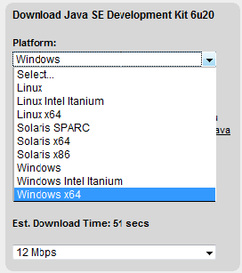
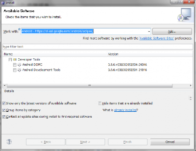

実は今までMac Bookに外部ディスプレイとキーボードを接続してデスクトップで開発していたのですが、Androidのエミュレータを起動していると地味に負荷が連続的にかかって発熱がひどくなってきたので、この度、Windows7 64bitのデスクトップPCを買いました。その際のAndroid開発環境のセットアップ(32bitと64bit環境)手順を以下に紹介します。

### Java 環境のインストール

下記サイトよりJDKをダウンロード＆インストール。 [Java SE Downloads](http://www.oracle.com/technetwork/java/javase/downloads/index.html) [](./jdk_download.png) ダウンロードするファイルはWindows x64 と Windows の二つ。それぞれインストールする。 64bit版 はProgram Filesフォルダに、32bit版はProgram Files (x86) フォルダにインストールされる。

```
C:\>java -version
java version "1.6.0_20"
Java(TM) SE Runtime Environment (build 1.6.0_20-b02)
Java HotSpot(TM) 64-Bit Server VM (build 16.3-b01, mixed mode)

```

### Android SDK のインストール

下記サイトよりダウンロードする。 [Android SDK | Android Developers](http://developer.android.com/sdk/index.html) 解凍後 SDK Setup.exe を実行する。その際に下記のようなエラーが発生した場合は、 画面左部のSettingsからチェックボックス Force https://... sources to be fetched using http;//... をチェックし、使用したいSDK Versionをインストールする。

```
Failed to fetch URL https://dl-ssl.google.com/android/repository/repository.xml, reason: HTTPS SSL error. You might want to force download through HTTP in the settings.

```

### Eclipse 64bit版のインストール

下記サイトよりダウンロードする。 [Eclipse Project Downloads](http://download.eclipse.org/eclipse/downloads/) 現在の最新バージョンのリンクをクリックし「Windows (x86\_64)」が64bit版Eclipseなので、クリックしてダウンロード。 _追記(2010-04-26)_：上記の手順の中で32bit版のJDK(with JRE)をインストールしているならば、下記の日本語版Eclipse(32bit版)を使用(pathも設定)してもOK(ちなみに私は結局この方法を採りました＾＾；)。 [Pleiades - Eclipse プラグイン日本語化プラグイン](http://mergedoc.osdn.jp/)

### Android Development Tools のインストール

[](./android_dev_tools_plugin-e1272172708275.png) Eclipse のプラグインインストール画面で下記のURLを追加し、インストールする。 追記(2012-06-01)：目にやさしいコードの配色は下記のXMLテーマを使用する。 Eclipse Color Themes 設定方法は、上部のメーニューバーより、 ウィンドウ > 設定 > 一般 > 外観 > 色テーマ > テーマのインポート よりダウンロードしたXMLファイルをインポート。 追記：上述は3.6想定でしたが、以下の手順でEclipse 3.7, Pleiades v1.3.3での日本語化ができましたので、ご参考下さい。 ■前提 Windows 7 64bit , java version “1.6.0\_24″ ■ダウンロード ・http://www.eclipse.org/downloads/ のEclipse Classic 3.7の64bitをダウンロード。 ・http://mergedoc.sourceforge.jp/index.html のPleiades 1.3.3 本体ダウンロード。 ■インストール手順 1. eclipse-SDK-3.7-win32-x86\_64.zipを適当なフォルダに解凍→eclipseフォルダが作成される。 2. pleiades\_1.3.3.zipの中身を全てeclipseフォルダへ移動→移動中にポップアップ表示される「フォルダを統合しますか?」は「はい」で進める。 3. eclipseフォルダ内のeclipse.iniファイルの最終行に以下の文字列と最後に空行を追加(pleiadesのreadmeに記載のインストール手順)。 -javaagent:plugins/jp.sourceforge.mergedoc.pleiades/pleiades.jar 4. eclipse.exeをダブルクリック (-cleanオプションなしで初回起動) 5. workspaceディレクトリを設定後、日本語化されたEclipseが起動。使用されているjavaw.exeプロセスも64bit版が使用されていることを確認。
