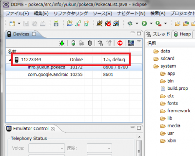

上記のメッセージはAndroidアプリをEclipseから実機でデバッグする際にDDMS上に出力されたエラーです。

```
[2010-06-05 15:16:21 - pokeca] Failed to upload pokeca.apk on device '11223344'
[2010-06-05 15:16:21 - pokeca] java.io.IOException 発生: Unable to open sync connection!
[2010-06-05 15:16:21 - pokeca] Launch canceled!

```

根本原因は不明ですが、対処として下記の手順を試みると解決しました。

1. コマンドライン上でadb kill-server
2. Android端末の接続を解除する(USBケーブルを抜く)
3. コマンドライン上でadb start-server
4. Android端末をUSBで再接続する。
5. DDMSで端末が正常に接続されているか確認する。
6. アプリのデバッグを開始→正常に実行される(OK!)。

### コマンド

```
C:\Users\yukun>adb kill-server
C:\Users\yukun>adb start-server
* daemon not running. starting it now *
* daemon started successfully *
C:\Users\yukun>

```

### 5の実行結果

[](./android_usb_connection_ddms-e1275743121420.png)

### 参考サイト

- anddev.org • View topic - Unable to open sync connection!
