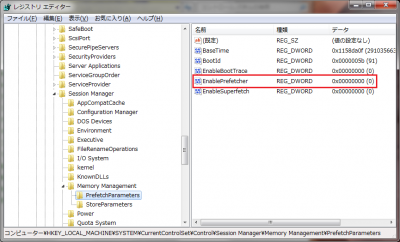
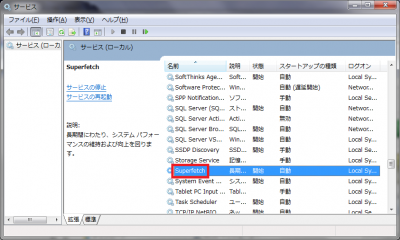
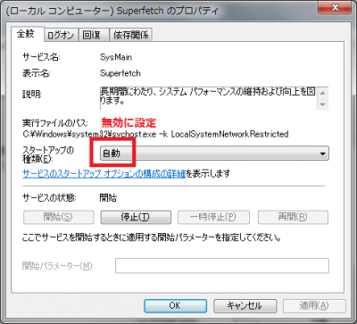
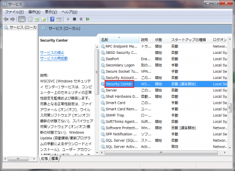
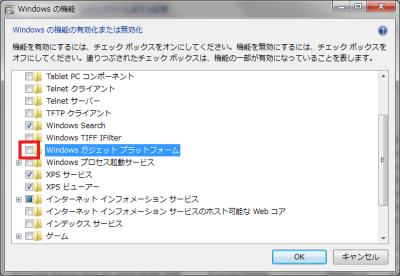
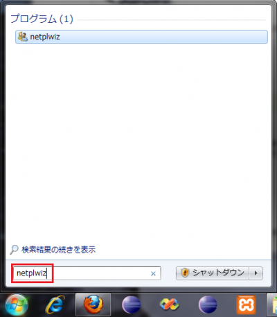
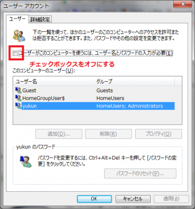

備忘録として以下のWindows7の使用リソースの軽量化設定の手順を簡単に紹介します。

1. プリフェッチを無効にする
2. スーパーフェッチを無効にする
3. セキュリティセンター機能の無効
4. 自動デフラグ停止
5. 使用しないWindowsの機能のアンインストール
6. 自動ログオン設定

<!-- truncate -->

### プリフェッチを無効にする

レジストリ：HKEY\_LOCAL\_MACHINE\\SYSTEM\\CurrentControlSet\\Control\\Session Manager\\Memory Management\\PrefetchParameters のEnablePrefetcherの値を0にする。 

### スーパーフェッチを無効にする

スタート→コントロールパネル→管理ツール→サービス→Superfetchをダブルクリックし、スタートアップの種類を「無効」に設定し、サービスを停止する。  

### セキュリティセンター機能の無効

スタート→コントロールパネル→管理ツール→サービス→Security Centerをダブルクリックし、スタートアップの種類を「無効」に設定し、サービスを停止する。 

### 自動デフラグ停止

スタート→アクセサリ→「ディスク　デフラグ　ツール」からスケジュール設定を無効化する。

### 使用しないWindowsの機能のアンインストール

スタート→コントロールパネル→プログラムと機能→Windowsの機能の有効化または無効化をクリック  ガジェットはバックグラウンドで常駐するので、使用しないのであれば、アンインストールした方が良い。

### 自動ログオン設定

スタート→ファイル検索で「netplwiz」を入力→実行  「ユーザーアカウント」画面で下図のチェックボックスをオフにする。 
