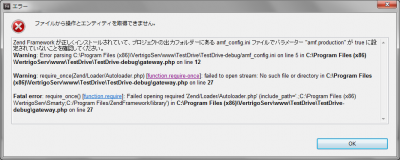
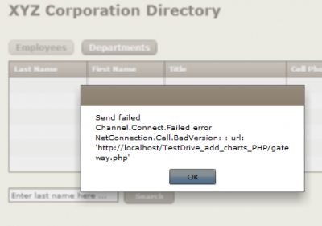

[](./error_require_autoloader-e1279985017921.png)

### 事象

Flex Builder 4でPHPとのデータコネクション設定を行う際に上図のエラーが発生。 使用したサンプルチュートリアル： connect to data - Flex Test Drive | Adobe Developer Connection 
<!-- truncate -->
 _エラーメッセージ_

```
Zend Framework が正しくインストールされていて、プロジェクトの出力フォルダーにある amf_config.ini ファイルでパラメーター "amf.production" が true に設定されていないことを確認してください。
Warning: Error parsing C:\Program Files (x86)\VertrigoServ\www\TestDrive\TestDrive-debug/amf_config.ini on line 5 in C:\Program Files (x86)\VertrigoServ\www\TestDrive\TestDrive-debug\gateway.php on line 12
Warning: require_once(Zend/Loader/Autoloader.php) [function.require-once]: failed to open stream: No such file or directory in C:\Program Files (x86)\VertrigoServ\www\TestDrive\TestDrive-debug\gateway.php on line 27
Fatal error: require_once() [function.require]: Failed opening required 'Zend/Loader/Autoloader.php' (include_path='.;C:\Program Files (x86)\VertrigoServ\Smarty;C:/Program Files/ZendFramework/library') in C:\Program Files (x86)\VertrigoServ\www\TestDrive\TestDrive-debug\gateway.php on line 27

```

_amf\_config.ini_

```
[zend]
;set the absolute location path of webroot directory, example:
;Windows: C:\apache\www
;MAC/UNIX: /user/apache/www
webroot =C:/Program Files (x86)/VertrigoServ/www
;set the absolute location path of zend installation directory, example:
;Windows: C:\apache\PHPFrameworks\ZendFramework\library
;MAC/UNIX: /user/apache/PHPFrameworks/ZendFramework/library
;zend_path =
[zendamf]
amf.production = false
amf.directories[]=TestDrive/services

```

_gateway.php_ 解決法 amf\_config.iniファイル中のwebrootパラメータをコメントアウトすると正常に設定が完了。 変更前

```
webroot =C:/Program Files (x86)/VertrigoServ/www
```

変更後

```
;webroot =C:/Program Files (x86)/VertrigoServ/www
```

### 原因

本来はC:/Program Files (x86)/VertrigoServ/www/ZendFramework/library/Zend/Loader/Autoloader.phpを参照をすべき所を、C:/Program Files/ZendFramework/library/Zend/Loader/Autoloader.phpを参照しようとしてエラーとなった。 webroot =C:/Program Files (x86)/VertrigoServ/wwwのはずが、どこで書き換わったのかな？ 今回はサンプルを走らせるのを優先したので、原因究明はここで止めています＞＜；

### 追記 - 2010/07/26

以下のようなエラーメッセージが出力された場合も、上記の原因と同一である場合があります。 [](./error_require_autoloader2-e1280153443846.png)

```
Send failed
Channel.Connect.Failed error NetConnection.Call.BadVersion: :
url: 'http://localhost/TestDrive_add_charts_PHP/gateway.php'

```

ご参考まで。
