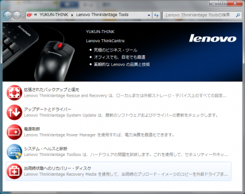
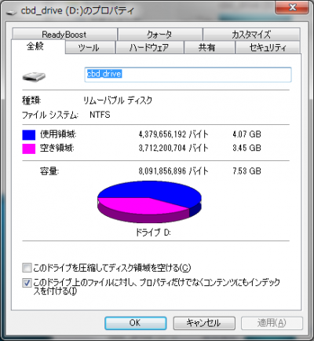

 先日サーバ用にLenovoのThinkCentreを30kで購入しました。出荷時はWindows7がプリインストールされていたので、折角なのでLinux系OSをインストールする前にリカバリーメディアを作成しておこうと思いました。 当初はバックアップメディアにDVD-Rを予定していたのですが、Rは色素劣化による読み込み不良を経験したことがあるので、USBメモリに変更し、手順は下記のサイトを参考に実施。 
<!-- truncate -->

1. Lenovo ThinkVantage Recovery Media で USBメモリーにリカバリーメディアを作成 - digitalbox
2. [Windows 7 リカバリー・メディアの作成。USBメモリーキーやUSBフラッシュ・ドライブにWindows 7 リカバリー・メディアを作成するには、あらかじめWindows VistaかWindows 7でパーティションを作成しておく必要があります。- ThinkPad](http://support.lenovo.com/ja_JP/detail.page?LegacyDocID=MIGR-74246)
3. [リカバリー・メディア の作成手順 - ThinkPad / ThinkCentre （Rescue and Recovery Ver 4.21 Windows Vistaプリロード機種）](http://support.lenovo.com/ja_JP/detail.page?LegacyDocID=SYJ0-024F290)

なお、リカバリーメディアの必要容量は4.07GB(4,379,656,192Byte)です。 
