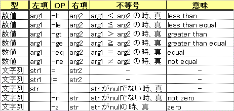

[](./test_command.gif) 上表はshの組み込み、かつ外部コマンドでもあるtestコマンドの判定表。testコマンドは与えられた条件式に対して、終了コードに**真「0」**、**偽「1」**を返す。他のプログラミング言語の条件判定とは真偽の値の意味が逆なので違和感を覚えるが、例えばC言語のmainのreturn (システムへのreturn)は正常では0、異常では1を返す例と同様と考えるとしっくりくるかな。。 
<!-- truncate -->
 

```bash
$ test 10 -gt 20
$ echo $?
1
$ test 10 -lt 20
$ echo $?
```

 以下のシェルスクリプトはtestコマンドを用いた条件判定のサンプルとなる。

### 数値の比較

#### スクリプトコード


```bash
#!/bin/sh
if test $1 -eq $2
then
	echo "($1)  = ($2)"
else
	echo "($1) != ($2)"
fi
if [ $1 -le $2 ]
then
	echo "($1) <= ($2)"
else
	echo "($1) >  ($2)"
fi
```

 尚、testコマンドは\[ _条件式_ \]でも記述できる。

#### 実行結果


```bash
$ sh test01.sh 10 10
(10)  = (10)
(10) <= (10)
$ sh test01.sh 10 20
(10) != (20)
(10) <= (20)
$ sh test01.sh 10 5
(10) != (5)
(10) >  (5)
```


### 文字列の比較

#### スクリプトコード


```bash
#!/bin/sh
if [ "$1" = "$2" ]
then
	echo "($1)  = ($2)"
else
	echo "($1) != ($2)"
fi
if [ "$3" != "" ]
then
	echo "\$3 is not null. It's <$3>."
fi
```


#### 実行結果


```bash
$ sh test02.sh hello world shell
(hello) != (world)
$3 is not null. It's <shell>.
$ sh test02.sh hello hello
(hello)  = (hello)
```


