### 目的

Windows7上のVMware Playerの仮想マシンにCentOSをインストールする。

### 準備

ダウンロードするものは下記の通り。 
<!-- truncate -->

1. [VMware Player ：簡単に仮想マシンを実行できる無償ソフトウェア](http://www.vmware.com/jp/products/desktop_virtualization/player/overview) 尚、ダウンロードには①苗字②名前③メールアドレスの入力が必要。ダウンロードファイルサイズは100MB程度で、インストールはウィザードに沿って進め、最後にPCの再起動をする。
2. [www.centos.org - The Community ENTerprise Operating System](http://www.centos.org/) CentOSはDownloadページ先のミラーサイトから「CentOS-_5.5_\-i386-bin-DVD.**torrent**」をダウンロードしtorrentクライアントソフトを用いてDVD ISOイメージをダウンロードする。尚、torrentクライアントソフトは[µTorrent](http://www.utorrent.com/)がオススメ。

### 仮想マシン・CentOSの導入手順

ウィザードに沿って導入が可能。 1. VMwareの初期画面から「新規仮想マシンの作成」を選択。 [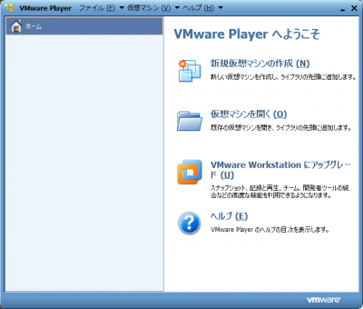](./vmware_main_window-e1298471485531.png) 2. インストーラー ディスク イメージ ファイルに上でダウンロードしたCentOSのisoイメージのファイルパスを入力。 [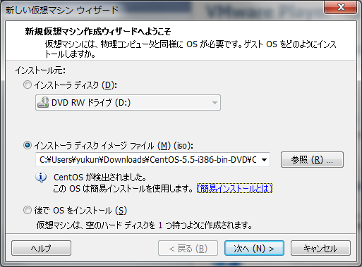](./vmware_makevm01.png) 3. ユーザーID名とそのパスワード、及びrootパスワードを入力 [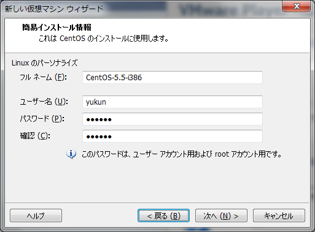](./vmware_makevm02.png) 4. 仮想マシン設定ファイルの決定(デフォルト) [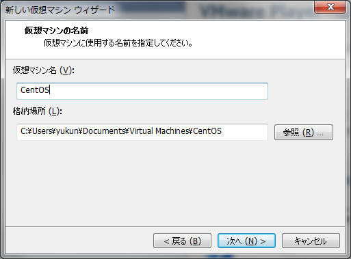](./vmware_makevm03.png) 5. ディスク容量の決定 [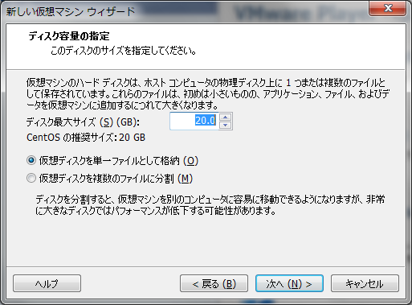](./vmware_makevm04.png) 6. 仮想マシンのハードウェアの設定 下図の「ハードウェアをカスタマイズ」をクリックすると仮想マシンのメモリやCPU数を設定可能。 [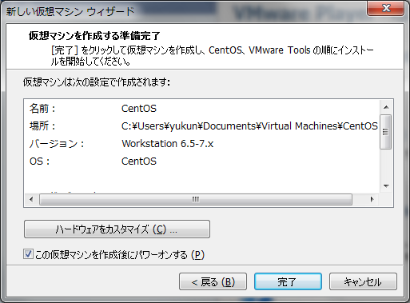](./vmware_makevm05.png) メモリの割当(下図では1GB) [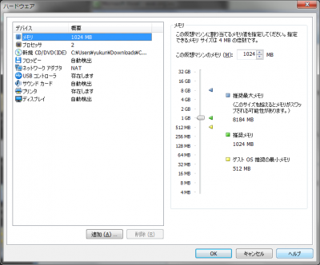](./vmware_makevm05_1-e1298472579686.png) 完了をクリックするとCentOSのインストールが開始。 7. インストール経過 [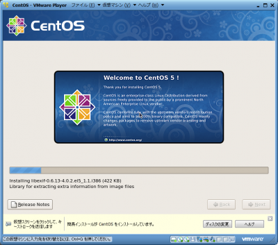](./vmware_centos01-e1298472185131.png) 8. インストール完了後は自動で立ち上がる [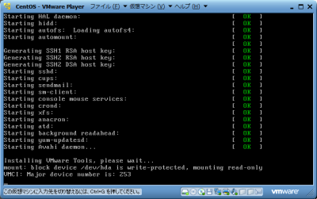](./vmware_centos03-e1298472229220.png) 9. ログイン画面 [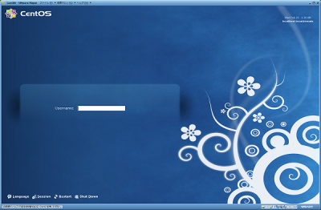](./vmware_centos04-e1298472339151.png) 10. Loginnameに手順3で入力したユーザー名 or 「root」を入力してログイン [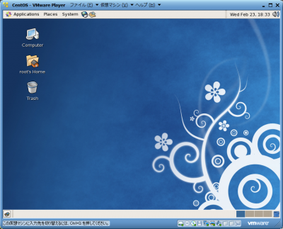](./vmware_centos05-e1298472437846.png) 以上、何か不明な点があればコメントにてお知らせ下さい。
