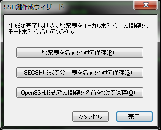

この度さくらVPS(OS: CentOS 5)を利用し始めた為、備忘録として掲載。

### 事前準備

先ずリモートコンソール上で以下の作業を実施。尚、コンソールはブラウザ上ではなく、Java Applet版の方が使い易い。

#### 既存のsshdサーバをアンインストール

```
# /etc/rc.d/init.d/sshd stop <-- 停止
# yum -y remove openssh <-- アンインストール

```


<!-- truncate -->


### OpenSSHサーバのインストール

最新版は以下のページで確認する。 [http://ftp.jaist.ac.jp/pub/OpenBSD/OpenSSH/portable/](http://ftp.jaist.ac.jp/pub/OpenBSD/OpenSSH/portable/)

```
# yum -y install pam-devel
# wget http://ftp.jaist.ac.jp/pub/OpenBSD/OpenSSH/portable/openssh-5.8p1.tar.gz <-- 最新版をダウンロード
# tar zxvf openssh-5.8p1.tar.gz
# vi openssh-5.3p1/contrib/redhat/openssh.spec

```

openssh.specの修正項目は以下の通り。

```
＜前略＞
%define no_x11_askpass 0 --> 1へ変更
%define no_gnome_askpass 0 --> 1へ変更
＜中略＞
%configure \
	configure --without-zlib-version-check \ <--追記
＜後略＞

```

./openssh-5.8p1/contrib/redhat以外のディレクトリを削除し、RPMパッケージを作成。

```
# rm -rf openssh-5.8p1/contrib/aix/
# rm -rf openssh-5.8p1/contrib/hpux/
# rm -rf openssh-5.8p1/contrib/caldera/
# rm -rf openssh-5.8p1/contrib/suse/
# rm -rf openssh-5.8p1/contrib/cygwin/
# rm -rf openssh-5.8p1/contrib/solaris/
# tar czvf openssh-5.8p1.tar.gz openssh-5.8p1/
# rm -rf openssh-5.8p1
# rpmbuild -tb --clean openssh-5.8p1.tar.gz

```

以下のようなdependencies errorが発生した場合は必要なパッケージをインストールする。(ここではopenssl-develとkrb5-develを導入)

```
# rpmbuild -tb --clean openssh-5.8p1.tar.gz
error: Failed build dependencies:
        openssl-devel is needed by openssh-5.8p1-1.x86_64
        krb5-devel is needed by openssh-5.8p1-1.x86_64
# yum -y install openssl-devel krb5-devel <-- 依存パッケージをインストール
# rpmbuild -tb --clean openssh-5.8p1.tar.gz <-- 再実行
＜中略＞
Processing files: openssh-debuginfo-5.8p1-1
Checking for unpackaged file(s): /usr/lib/rpm/check-files /var/tmp/openssh-5.8p1-buildroot
Wrote: /usr/src/redhat/RPMS/x86_64/openssh-5.8p1-1.x86_64.rpm
Wrote: /usr/src/redhat/RPMS/x86_64/openssh-clients-5.8p1-1.x86_64.rpm
Wrote: /usr/src/redhat/RPMS/x86_64/openssh-server-5.8p1-1.x86_64.rpm
Wrote: /usr/src/redhat/RPMS/x86_64/openssh-debuginfo-5.8p1-1.x86_64.rpm
＜後略＞
#

```

RPMパッケージの作成が完了したらそれらをインストールする。

```
# rpm -Uvh  /usr/src/redhat/RPMS/x86_64/openssh-5.8p1-1.x86_64.rpm
Preparing...                ########################################### [100%]
   1:openssh                ########################################### [100%]
# rpm -Uvh /usr/src/redhat/RPMS/x86_64/openssh-server-5.8p1-1.x86_64.rpm
Preparing...                ########################################### [100%]
   1:openssh-server         ########################################### [100%]
# rpm -Uvh /usr/src/redhat/RPMS/x86_64/openssh-clients-5.8p1-1.x86_64.rpm
Preparing...                ########################################### [100%]
   1:openssh-clients        ########################################### [100%]
# rm -f  /usr/src/redhat/RPMS/x86_64/openssh-* <-- RPMを削除
# rm -f openssh-5.8p1.tar.gz <-- ダウンロードファイルを削除

```

#### sshdサーバの起動

```
# /etc/rc.d/init.d/sshd start <-- 起動
# chkconfig sshd on <-- 自動起動設定
# chkconfig --list sshd <-- 2-5がonを確認
sshd            0:off   1:off   2:on    3:on    4:on    5:on    6:off

```

### 公開鍵・秘密鍵を作成

sshクライアントがPoderosaである場合の操作手順を一気に書くと、 メニューバー\[ツール\] --> SSH鍵作成ウィザード --> 初期値のまま、ユーザーのパスフレーズを入力し次へ --> マウスをグリグリ動かして鍵生成 -->「秘密鍵を名前をつけて保存」と「OpenSSH形式で公開鍵を名前をつけて保存」のボタンで公開鍵・秘密鍵を作成(下図参照)。 [](./ssh_key_gen.png) 作成した公開鍵(文字列)を~/.ssh/authorized\_keysに保存する。

```
$ mkdir -p ~/.ssh
$ chmod 700 ~/.ssh
$ vi ~/.ssh/authorized_keys
$ chmod 600 ~/.ssh/authorized_keys

```

### sshサーバの設定

設定ファイルを編集し鍵方式のみでのログインを許可する設定とする。

```
# vi /etc/ssh/sshd_config

```

変更要素、コメント解除行は以下のとおり。

```
Protocol 2 <-- SSH2のみ
SyslogFacility AUTHPRIV <-- ログファイルをCentOSデフォルトに
PermitRootLogin no <-- rootログイン禁止
PasswordAuthentication no <-- パスでのログイン禁止
PermitEmptyPasswords no <-- パスなしログイン禁止

```

最後に設定を反映して完了。

```
# /etc/rc.d/init.d/sshd reload
Reloading sshd:                                            [  OK  ]

```

ちらっとアクセスログ(/var/log/secure)を確認したら、結構なBFAがあった。世のBotの監視は半端ない。公開後1時間足らずだというのに。。。sshdの待ち受けポートを変えるだけでも効果はありそう。 ちなみに、クライアント側で鍵を設置していないのにも関わらずサーバ側へアクセスを試みると下記の様なエラーメッセージが出力される。

```
$ ssh ****@example.com
The authenticity of host 'example.com (***.***.***.***)' can't be established.
RSA key fingerprint is cc:e5:62:bb:be:9a:f8:cc:74:2a:77:a7:ec:6a:ac:dc.
Are you sure you want to continue connecting (yes/no)? yes
Warning: Permanently added 'example.com (***.***.***.***)' (RSA) to the list of known hosts.
Permission denied (publickey,keyboard-interactive).

```

### 追記(2011-05-04)：WinSCPでの秘密鍵設定

WinSCPはPuTTY(\*.ppk)の鍵しか対応していない為、Poderosaで作成した秘密鍵を使用するには、ppk形式に変換する必要がある。変換手順は、WinSCP付属アプリのPuTTY Key Generatorを起動し、メニュー「Conversions」→「Import key」で変換。
