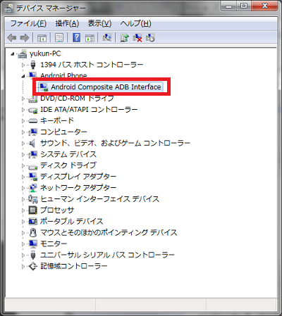
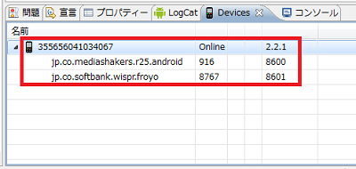
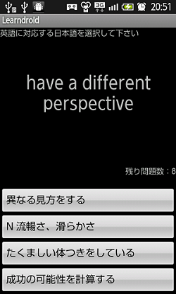

Androidのデバックはこれまでお古X06HTで実施していましたが、やはりいつも使う携帯(SHARP 005SH)でデバック・テストをしたい為、その環境準備を以下に記載。 
<!-- truncate -->

### 手順

1. USBドライバのインストール
2. SHARP共通 ADB USBドライバのダウンロード
3. 端末設定の“USBデバッグ”にチェックを入れ、有効
4. 携帯をPCに接続する。ここでドライバのインストール画面が起動した場合は、ダウンロードしたADB USBドライバのフォルダを選択。 インストール画面が起動しなかった場合は、デバイスマネージャからインストールする。 

インストール後Eclipseを確認するとデバイスが認識されていることが確認できる。  試しに現在開発中の英単語学習アプリのキャプチャを取得したので以下に紹介します。 

<iframe src="http://rcm-jp.amazon.co.jp/e/cm?lt1=_blank&amp;bc1=F8F8F8&amp;IS2=1&amp;bg1=F8F8F8&amp;fc1=000000&amp;lc1=0000FF&amp;t=ref22-22&amp;o=9&amp;p=8&amp;l=as4&amp;m=amazon&amp;f=ifr&amp;ref=ss_til&amp;asins=B005BYXWW8" style="width:120px;height:240px;" scrolling="no" marginwidth="0" marginheight="0" frameborder="0" align="right"></iframe>

 尚、アプリの開発進捗は今後Twitterでつぶやいていくかも。 余談ですが、先日買った携帯カバーが優秀。つけると携帯の電池熱のじんわりやテカテカツルツルの指紋汚れが合わせて解消します。お試しあれ。
