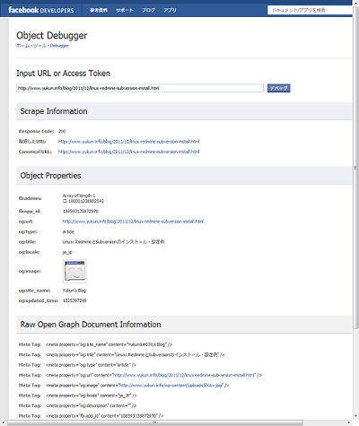

FacebookのOGP pluginについては、結構な頻度で仕様変更があるので、Webにある過去の記事を参考にさせて頂くものの、なかなか上手くいかないこともあり、今回設置には手間取ったので、その作業経過をまとめておきます。結論から言うと設置にはWordPressのプラグインは使用せず、テーマファイルを直接編集する方法を採り、無事FacebookのDebugツールで認識できました。 
<!-- truncate -->
 追記(2012-12-22)：下記の公式Facebookプラグインがリリースされていますね。。これであればog:imageタグ以外は全てプラグイン経由で設定できるのでかなり便利です。og:imageタグだけはテーマのヘッダーに直接一行挿入することとなります。 [WordPress › Facebook « WordPress Plugins](http://wordpress.org/extend/plugins/facebook/) 以下は上記のプラグインを導入以前に採った手法です。

### 設定手順

1. Facebookアプリの作成
2. Social Pluginsコードを取得
3. WordPressのテーマ編集(Pluginsコードの埋め込み)
4. Debugツールで設定内容確認

### 1\. Facebookアプリの作成

下記のリンクより、Facebookアプリを作成し「App ID/API Key」を取得する。 [Facebook開発者](https://developers.facebook.com/apps) 併せてユーザーIDも以下のURLにアクセスし控えておく("id"部分)。 https://graph.facebook.com/＜ユーザー名＞ 例：私の場合はyu.sskがユーザーのURLなので以下のアドレスを入力することとなる。 https://graph.facebook.com/yu.ssk

### 2\. Social Pluginsコードを取得

下記のサイトから、Like Button, Commentsのコードを取得する。 [Social Plugins - Facebook開発者](https://developers.facebook.com/docs/plugins/) - [Like Button - Facebook開発者](https://developers.facebook.com/docs/reference/plugins/like/) - [Comments - Facebook開発者](https://developers.facebook.com/docs/reference/plugins/comments/)

### 3\. WordPressのテーマ編集(Pluginsコードの埋め込み)

私の場合、テーマの修正箇所は以下のタグ・要素となった。 ※使用テーマはデフォルトのTwenty Ten。

1. ヘッダー(header.php)
2. コメント(comments.php)

#### ヘッダー(header.php)

先ずhtmlタグ内の要素を以下のように修正し、OGPとFacebookの名前空間の定義、prefixを追加する。 

```html
<html <?php language_attributes(); ?>
xmlns:og=”http://ogp.me/ns#”
xmlns:fb=”http://www.facebook.com/2008/fbml”
prefix="og: http://ogp.me/ns# fb: http://www.facebook.com/2008/fbml" >
```

 次にheadタグ内に取得したPluginコードを埋め込む。 

```html
<head>
<meta charset="<?php bloginfo( 'charset' ); ?>" />
<meta property="og:site_name" content="Yukun's Blog" />
<meta property="og:title" content="<?php if (get_the_title() === 'Home') { echo "Yukun's Blog"; } else { the_title(); } ?>" />
<meta property="og:type" content="<?php if (get_permalink() === 'http://www.yukun.info/') { echo 'website'; } else { echo 'article'; } ?>" />
<meta property="og:url" content="<?php the_permalink(); ?>" />
<meta property="og:image" content="https://yukun.info/wp-content/uploads/2011/12/EXA-i.jpg" />
<meta property="og:locale" content="ja_JP" />
<meta property="og:description" content="<?php echo mb_substr(strip_tags($post->post_content), 0, 100, 'UTF-8') . '...'; ?>" />
<meta property="fb:app_id" content="108593135872970" />
<meta property="fb:admins" content="100001238982542" />
＜後略＞
```

 工夫したところは、私のブログの構成上はトップページでget\_the\_title()を実行すると"Home"になるので、その場合はブログ名に置換することや、ブログの個別ページを表示する場合はog:typeを"article"とし、トップページは"blog"とするよう、条件式を挿入したところかな。og:descriptionタグについては文字数調整＋タグを除去の上格納する。 また、bodyタグ直下にPluginページで取得した以下のコードを埋め込む。 

```html
<div id="fb-root"></div>
<script>(function(d, s, id) {
  var js, fjs = d.getElementsByTagName(s)[0];
  if (d.getElementById(id)) return;
  js = d.createElement(s); js.id = id;
  js.src = "//connect.facebook.net/ja_JP/all.js#xfbml=1&appId=108593135872970";
  fjs.parentNode.insertBefore(js, fjs);
}(document, 'script', 'facebook-jssdk'));</script>
```


#### コメント(comments.php)

次に実際にLikeボタンやcommentボックスのコードを埋め込むが、私のブログではcomments.phpの頭にコードを挿入することで、デザイン上収まった。 

```html
<h3 id="reply-title">Facebook comments:</h3>
<div class="fb-like"
data-href="<?php the_permalink(); ?>"
data-send="true"
data-width="550"
data-show-faces="true"
data-font="arial">
</div>
<div class="fb-comments"
data-href="<?php the_permalink(); ?>"
data-num-posts="5"
data-width="550">
</div>
```


### 4\. Debugツールで設定内容確認

以下のリンク先ページでブログ記事のURLを入力するとそのページの設定内容が確認できる。 [Debugger - Facebook開発者](https://developers.facebook.com/tools/debug) 仮に問題があった場合は Warning で対処メッセージが表示される為、愚直に対応する(^\_^;)

#### 実行例

[](./facebook_object_debugger_result.png) 何かご質問があればお気軽にコメント頂ければと思います。
