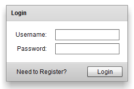

[](./flex_login_state.png) FlexのStateの遷移によって表示するUIを変更することで、簡潔に画面遷移を実現する。その際のTransition効果(フェード)を付与する。今回はログインフォームを例に採り、ユーザーのログイン画面と新規登録画面の2つの状態をStateによって切り替えるmxmlソースを下記に紹介する。 
<!-- truncate -->


### 実行結果

下記のリンクをご参照。 ログイン・登録フォーム

### ソースコード


```actionscript
<?xml version="1.0" encoding="utf-8"?>
<s:Application xmlns:fx="http://ns.adobe.com/mxml/2009"
			   xmlns:s="library://ns.adobe.com/flex/spark"
			   xmlns:mx="library://ns.adobe.com/flex/mx"
			   currentState="Login">
	<!-- 初期状態は"Login" -->
	<!-- 状態遷移エフェクト -->
	<s:transitions>
		<s:Transition fromState="*" toState="*">
			<s:effect>
				<s:Parallel targets="{[registerLink, registerButton, loginLink, loginButton, confirm, email]}">
					<s:children>
						<s:Fade alphaFrom="0" alphaTo="1"/>
					</s:children>
				</s:Parallel>
			</s:effect>
		</s:Transition>
	</s:transitions>
	<!-- 状態 -->
	<s:states>
		<s:State name="Login"/>
		<s:State name="Register"/>
	</s:states>
	<fx:Declarations>
		<!-- 非ビジュアルエレメント (サービス、値オブジェクトなど) をここに配置 -->
	</fx:Declarations>
	<!-- ログイン用パネル -->
	<s:Panel title="Login" id="loginPanel" includeIn="Login" horizontalCenter="0" verticalCenter="-2">
		<mx:Form id="loginForm">
			<mx:FormItem label="Username:">
				<s:TextInput/>
			</mx:FormItem>
			<mx:FormItem label="Password:">
				<s:TextInput/>
			</mx:FormItem>
		</mx:Form>
		<s:controlBarContent>
			<mx:LinkButton label="Need to Register?" id="registerLink"
						   click="currentState='Register'"/>
			<mx:Spacer width="100%" id="spacer1"/>
			<s:Button label="Login" id="loginButton"/>
		</s:controlBarContent>
	</s:Panel>
	<!-- 新規登録用パネル -->
	<s:Panel title="Register" id="registerPanel" includeIn="Register" horizontalCenter="0" verticalCenter="-2">
		<mx:Form id="registerForm">
			<mx:FormItem label="Username:">
				<s:TextInput/>
			</mx:FormItem>
			<mx:FormItem label="Password:">
				<s:TextInput/>
			</mx:FormItem>
			<mx:FormItem id="confirm" label="Confirm:">
				<s:TextInput/>
			</mx:FormItem>
			<mx:FormItem id="email" label="E-Mail:">
				<s:TextInput/>
			</mx:FormItem>
		</mx:Form>
		<s:controlBarContent>
			<mx:LinkButton label="Return to Login" id="loginLink"
						   click="currentState='Login'"/>
			<mx:Spacer width="100%" id="spacer2"/>
			<s:Button label="Register" id="registerButton"/>
		</s:controlBarContent>
	</s:Panel>
</s:Application>
```

 ※余談： フォルダを整理していたら古いFlexコードが出てきたので、この度当サイトに転記したもの。基本Tips系のコードはブログに載せてローカルには保存しないようにする予定。どうせその類のコードは一週間後には読まなくなるし、それ以降はソースの保管場所さえ忘れてしまう恐れもある為。
