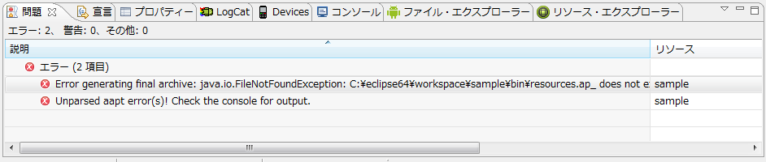

[](./eclipse_android_project_error.png) 久々にAndroid プロジェクトを新規作成→ビルドしたところ、上図のエラーが出力された。 詳細原因は深く調査していないが、以下の操作を以て解決したので、ご参考まで。 
<!-- truncate -->
 0. (事象)アプリのデバッグ/実行時に下記のエラーが発生しデバッグ/実行処理が開始しない。

```
Error generating final archive: java.io.FileNotFoundException:
C:\eclipse64\workspace\sample\bin\resources.ap_ does not exist	XXXXXXX
不明	Android Packaging Problem

```

1\. Eclipseメニュー→「プロジェクト」→「クリーン」を実行。 2. デバッグ→Androidアプリケーションを実行するも以下のエラーメッセージが発生(>\_<)

```
エラー: Unknown command 'crunch'

```

3\. Eclipseメニュー→「ウィンドウ」→「Android SDK Manager」から、SDKのUpdateし再実行。 4. 正常にアプリが実行されるものの、Logcatビューで以下のメッセージが表示され、ログを参照できない(>\_<)

```
Unable to create view ID com.android.ide.eclipse.ddms.views.LogCatView:
com.android.ddmuilib.logcat.LogCatPanel$13.
(Lcom/android/ddmuilib/logcat/LogCatPanel;)V

```

5\. Eclipseを「eclipse.exe -clean」オプション付きで起動し直す。(pleiadesを使用している場合はeclipse.exe -clean.cmdファイルをダブルクリックしても良い) 6. 再度ADV諸々実行し直し、正常にアプリがデバッグ/実行されることを確認。
