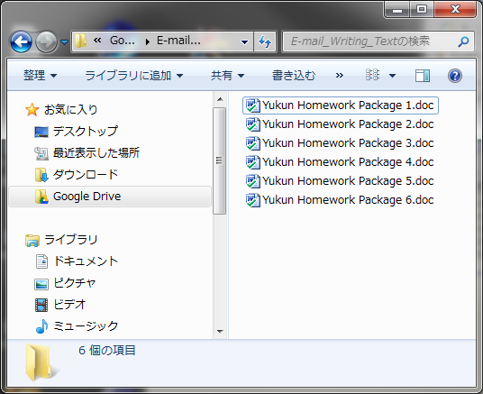
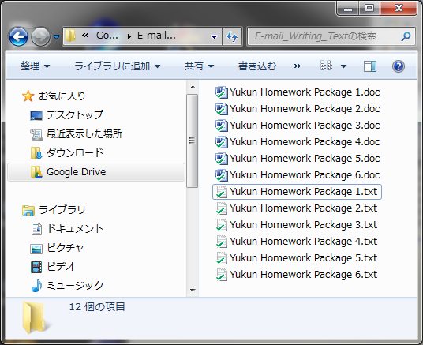

COM(Component Object Model)を使用してWordファイル内のテキストをテキストファイルへ抽出・変換するスクリプト。

### ソースコード


```python
 # coding: utf-8 import fnmatch, os, sys, win32com.client if __name__ == '__main__': wa = win32com.client.gencache.EnsureDispatch("Word.Application") try: for path, dirs, files in os.walk(sys.argv[1]): # コマンドラインより探索ディレクトリpathを取得 for filename in files: if not fnmatch.fnmatch(filename, "*.doc"): continue # wordファイルの拡張子かをパターン・マッチング doc = os.path.abspath(os.path.join(path, filename)) # wordファイルへの絶対パスを作成 print "processing %s in %s" % (doc, path) wa.Documents.Open(doc) txt = doc[:-3] + 'txt' # 変換保管するテキストファイル名 wa.ActiveDocument.SaveAs(txt, FileFormat=win32com.client.constants.wdFormatText) wa.ActiveDocument.Close() finally: wa.Quit() # Wordの終了 
```

 
<!-- truncate -->


### 実行結果

上記のソースコードをwordtotext.pyで保管し実行。ここでは当方環境でWordファイルが保管されているディレクトリを指定し、実行する。

```
>python wordtotext.py "C:\Users\yukun\Google Drive\E-mail_Writing_Text"
processing C:\Users\yukun\Google Drive\E-mail_Writing_Text\Yukun Homework Package 1.doc in C:\Users\yukun\Google Drive\E-mail_Writing_Text
processing C:\Users\yukun\Google Drive\E-mail_Writing_Text\Yukun Homework Package 2.doc in C:\Users\yukun\Google Drive\E-mail_Writing_Text
processing C:\Users\yukun\Google Drive\E-mail_Writing_Text\Yukun Homework Package 3.doc in C:\Users\yukun\Google Drive\E-mail_Writing_Text
processing C:\Users\yukun\Google Drive\E-mail_Writing_Text\Yukun Homework Package 4.doc in C:\Users\yukun\Google Drive\E-mail_Writing_Text
processing C:\Users\yukun\Google Drive\E-mail_Writing_Text\Yukun Homework Package 5.doc in C:\Users\yukun\Google Drive\E-mail_Writing_Text
processing C:\Users\yukun\Google Drive\E-mail_Writing_Text\Yukun Homework Package 6.doc in C:\Users\yukun\Google Drive\E-mail_Writing_Text

```

◯実行前ディレクトリ [](./pytnon_wordtotxt_before.png) ◯実行後ディレクトリ [](./pytnon_wordtotxt_after.png)

### 参考サイト

- [fnmatch — Unix ファイル名のパターンマッチ](https://docs.python.org/ja/3/library/fnmatch.html)
- [15.1. os — Miscellaneous operating system interfaces — Python v2.7.3 documentation](http://docs.python.org/2/library/os.html)
