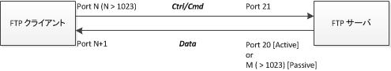

FTP(File Transfer Protocol)はInternet Request for Comment(RFC) 959で定義されているファイル転送プロトコルであるが、この度、改めてFTPの仕組み、特にクライアント-サーバ間の接続方法を確認。  上図より接続のフローを簡単に説明すると、

1. クライアント→サーバ(port 21)へTCPで制御用の接続を試みる
2. サーバ→クライアントへTCPでデータ伝送用の接続を試みる
3. 両コネクションにてコマンドのやり取り＋データの伝送を行う

FTPにはActive/Passiveの2つのモードがあるが、両モードの違いはサーバ→クライアントへの接続に使用するサーバ側の送信ポートの違いである。図の通り、Activeモードはport 20番、Passiveモードは1024以上のport番号からランダムに選択したものを使用する。
