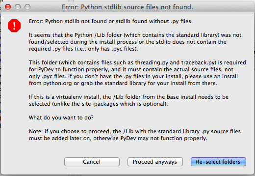

先日MacBook Airを購入したが、Eclipse+PyDevのセットアップに考慮が必要だった為、インストール方法を紹介する。 
<!-- truncate -->


### 発端

Macに標準のPythonにPyDevでのPythonインタプリターの設定を試みたところ、下記のエラーメッセージが発生。 ・エラー画面(Error: Python stdlib not found or stdlib found without .py files.) [](./error_python_stdlib_not_found.png) 内容としては、標準のパスには必要なファイルがない〜的なもの。検索すると、同事象は下記のフォーラムで既に上がっていたので参考にさせて頂いた。 ・[PyDev Eclipse Python interpreters Error: stdlib not found - Stack Overflow](http://stackoverflow.com/questions/5595276/pydev-eclipse-python-interpreters-error-stdlib-not-found)

### 対処法

結論から言うと、Mac標準のものではなく、Python.orgのPythonを使用することで解決する。

### インストール方法

下記のサイトからMac用のPythonパッケージ(この場合は2.7.2バージョン)をダウンロード・インストールする。 ・[Python 2.7.2 Release](http://www.python.org/download/releases/2.7.2/) 続けて、下記のサイトからEclipseをインストール。 ・[Eclipse Downloads](http://www.eclipse.org/downloads/) Eclipseを起動後にメニューのHelp->Install New Softwareをクリックし下記のアドレスを追加し、表示されるパッケージをインストール。 ・PyDev - http://pydev.org/updates Pydevをインストール後に、Eclipseの環境設定->PyDev->Interpreter - Python画面でPython のInterpreterのパスを下記の通り指定するとエラーもなく完了する。 /Library/Frameworks/Python.framework/Versions/2.7/bin/python2.7 ※尚、上述のパスはReadmeに載っている。

> The installer puts applications, an "Update Shell Profile" command, and an Extras folder containing demo programs and tools into the "Python 2.7" subfolder of the system Applications folder, and puts the underlying machinery into the folder /Library/Frameworks/Python.framework. It can optionally place links to the command-line tools in /usr/local/bin as well. Double-click on the "Update Shell Profile" command to add the "bin" directory inside the framework to your shell's search path.

### Pythonへのシンボリックリンクの作成

ターミナル上で使用するPythonもPython.orgのものにする場合は、シンボリックリンクを下記のように置き換える。 ※()書きのところはコメントの為、入力不要。 

```bash
 $ sudo rm /usr/bin/python (既存のリンクを削除) $ sudo ln -s /Library/Frameworks/Python.framework/Versions/2.7/bin/python2.7 /usr/bin/python (新しく設定) $ ls -l python (リンク情報を確認) lrwxr-xr-x 1 root wheel 63 6 30 15:56 python -> /Library/Frameworks/Python.framework/Versions/2.7/bin/python2.7 $ python (反映されているか試しに起動する) Python 2.7.2 (v2.7.2:8527427914a2, Jun 11 2011, 15:22:34) [GCC 4.2.1 (Apple Inc. build 5666) (dot 3)] on darwin Type "help", "copyright", "credits" or "license" for more information. >>> quit() 
```


