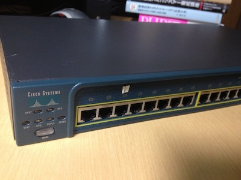
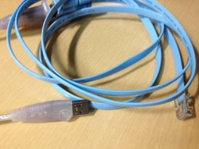
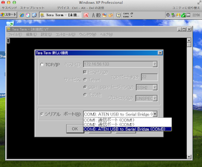

[](./Cisco_2950_Switch.jpg) 先日、ありがたいことにCisco 2950スイッチを使用する機会があったので、早速enableパスワードの初期化作業を実施した。 
<!-- truncate -->


### 準備

#### コンソールケーブル

[](./Cisco_consol_cable.jpg) 下記の二つを用意。

1. [コンソールケーブル(RJ45-DB9)](http://www.amazon.co.jp/gp/product/B005F7LN4K/ref=as_li_ss_tl?ie=UTF8&camp=247&creative=7399&creativeASIN=B005F7LN4K&linkCode=as2&tag=ref22-22)
2. [SANWA SUPPLY USB-CVRS9 USB-RS232Cコンバータ](http://www.amazon.co.jp/gp/product/B00008B96I/ref=as_li_ss_tl?ie=UTF8&camp=247&creative=7399&creativeASIN=B00008B96I&linkCode=as2&tag=ref22-22)

#### Windows PC

MacのVM Ware Fusion 上の仮想Windows OS上でもOK。

#### TeraTerm

下記のリンクよりダウンロードする。 [Tera Term (テラターム) プロジェクト日本語トップページ - SourceForge.JP](http://sourceforge.jp/projects/ttssh2/)

### 手順

1. TeraTermを起動し、接続方法を下図の通りシリアル　ポート®: ATEN USB to Serial Bridgeを選択しOKボタンを押下。 [](./TeraTerm_usb_serial_bridge.png)
2. スイッチのMOODボタンを押した状態で電源ONで待機(SYST LEDが緑の点灯になるまで)。以下TeraTerm上でコマンド打鍵作業。
3. switch: flash\_init
4. switch: load\_helper
5. switch: dir flash:
6. switch: rename flash:config.text flash:config.old2 configファイルの名前変更。(名前は何でも良い)
7. switch: boot システムをブートする。
8. ブート後に立ち上がったら、 Switch>en 特権モードに入る。
9. Switch#copy running-config startup-config 現状のプレーンな設定を反映
10. Switch#logout

パスワードを再設定したい場合はpassword \*\*\*\*\*コマンドで設定する。

### 実行結果ログ

```
C2950 Boot Loader (C2950-HBOOT-M) Version 12.1(11r)EA1, RELEASE SOFTWARE (fc1)
Compiled Mon 22-Jul-02 17:18 by antonino
WS-C2950-24 starting...
Base ethernet MAC Address: 00:11:bb:4f:68:80
Xmodem file system is available.
The system has been interrupted prior to initializing the
flash filesystem.  The following commands will initialize
the flash filesystem, and finish loading the operating
system software:
    flash_init
    load_helper
    boot
switch: flash_init
Initializing Flash...
flashfs[0]: 88 files, 3 directories
flashfs[0]: 0 orphaned files, 0 orphaned directories
flashfs[0]: Total bytes: 7741440
flashfs[0]: Bytes used: 6141952
flashfs[0]: Bytes available: 1599488
flashfs[0]: flashfs fsck took 8 seconds.
...done initializing flash.
Boot Sector Filesystem (bs:) installed, fsid: 3
Parameter Block Filesystem (pb:) installed, fsid: 4
switch: load_helper
switch: dir flash:
Directory of flash:/
2    -rwx  269                      env_vars
3    -rwx  3036020                  c2950-i6q4l2-mz.121-20.EA1a.bin
4    -rwx  1576                     vlan.dat
7    -rwx  110                      info
8    drwx  2688                     html
90   -rwx  110                      info.ver
91   -rwx  5883                     config.old
92   -rwx  1648                     config.text
93   -rwx  5                        private-config.text
1599488 bytes available (6141952 bytes used)
switch: rename flash:config.text flash:config.old2
switch: boot
Loading "flash:/c2950-i6q4l2-mz.121-20.EA1a.bin"...######################################################################################################################################################################################################################################################################################################
File "flash:/c2950-i6q4l2-mz.121-20.EA1a.bin" uncompressed and installed, entry point: 0x80010000
executing...
              Restricted Rights Legend
Use, duplication, or disclosure by the Government is
subject to restrictions as set forth in subparagraph
(c) of the Commercial Computer Software - Restricted
Rights clause at FAR sec. 52.227-19 and subparagraph
(c) (1) (ii) of the Rights in Technical Data and Computer
Software clause at DFARS sec. 252.227-7013.
           cisco Systems, Inc.
           170 West Tasman Drive
           San Jose, California 95134-1706
Cisco Internetwork Operating System Software
IOS (tm) C2950 Software (C2950-I6Q4L2-M), Version 12.1(20)EA1a, RELEASE SOFTWARE (fc1)
Copyright (c) 1986-2004 by cisco Systems, Inc.
Compiled Mon 19-Apr-04 20:58 by yenanh
Image text-base: 0x80010000, data-base: 0x805A8000
Initializing flashfs...
flashfs[1]: 88 files, 3 directories
flashfs[1]: 0 orphaned files, 0 orphaned directories
flashfs[1]: Total bytes: 7741440
flashfs[1]: Bytes used: 6141952
flashfs[1]: Bytes available: 1599488
flashfs[1]: flashfs fsck took 8 seconds.
flashfs[1]: Initialization complete.
Done initializing flashfs.
POST: System Board Test : Passed
POST: Ethernet Controller Test : Passed
ASIC Initialization Passed
POST: FRONT-END LOOPBACK TEST : Passed
cisco WS-C2950-24 (RC32300) processor (revision Q0) with 20713K bytes of memory.
Processor board ID FOC0832Y13A
Last reset from system-reset
Running Standard Image
24 FastEthernet/IEEE 802.3 interface(s)
32K bytes of flash-simulated non-volatile configuration memory.
Base ethernet MAC Address: 00:11:BB:4F:68:80
Motherboard assembly number: 73-5781-13
Power supply part number: 34-0965-01
Motherboard serial number: FOC08321H04
Power supply serial number: DAB0831CD9C
Model revision number: Q0
Motherboard revision number: A0
Model number: WS-C2950-24
System serial number: FOC0832Y13A
         --- System Configuration Dialog ---
Would you like to enter the initial configuration dialog? [yes/no]: no
00:00:15: %SPANTREE-5-EXTENDED_SYSID: Extended SysId enabled for type vlan
00:00:19: %SYS-5-RESTART: System restarted --
Cisco Internetwork Operating System Software
IOS (tm) C2950 Software (C2950-I6Q4L2-M), Version 12.1(20)EA1a, RELEASE SOFTWARE (fc1)
Copyright (c) 1986-2004 by cisco Systems, Inc.
Compiled Mon 19-Apr-04 20:58 by yenanh
00:00:19: %SNMP-5-COLDSTART: SNMP agent on host Switch is undergoing a cold start
Press RETURN to get started!
00:01:35: %LINK-5-CHANGED: Interface Vlan1, changed state to administratively down
00:01:36: %LINEPROTO-5-UPDOWN: Line protocol on Interface Vlan1, changed state to down
Switch>
Switch>en
Switch#dir
Directory of flash:/
    2  -rwx         269   Jan 1 1970 00:01:47 +00:00  env_vars
    3  -rwx     3036020   Mar 1 1993 00:03:59 +00:00  c2950-i6q4l2-mz.121-20.EA1a.bin
    4  -rwx        1576   Mar 1 1993 00:00:19 +00:00  vlan.dat
    7  -rwx         110   Mar 1 1993 00:02:17 +00:00  info
    8  drwx        2688   Mar 1 1993 00:07:29 +00:00  html
   90  -rwx         110   Mar 1 1993 00:08:11 +00:00  info.ver
   91  -rwx        5883  Jul 16 1993 01:44:46 +00:00  config.old
   92  -rwx        1648   Mar 1 1993 00:02:12 +00:00  config.old2
   93  -rwx           5   Mar 1 1993 00:02:12 +00:00  private-config.text
7741440 bytes total (1599488 bytes free)
Switch#copy running-config startup-config
Destination filename [startup-config]?
Building configuration...
[OK]
Switch#
Switch#logout

```

### 参考書籍

[Ciscoネットワーク構築教科書\[設定編\]](http://www.amazon.co.jp/gp/product/4844328298/ref=as_li_ss_tl?ie=UTF8&camp=247&creative=7399&creativeASIN=4844328298&linkCode=as2&tag=bitsmining-22)
