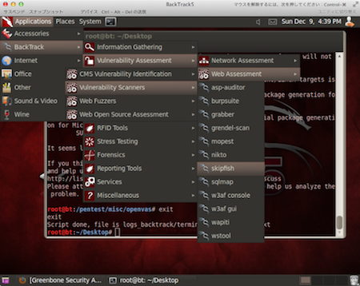

### Skipfishとは

Googleが公開している、Webアプリケーション向けのセキュリティ脆弱性スキャナソフトウェア。 オフィシャルサイト：[skipfish - web application security scanner - Google Project Hosting](https://code.google.com/archive/p/skipfish/) 
<!-- truncate -->


### 導入・インストール方法

今回は割愛。LinuxのBackTrackディストリビューションを使用すればデフォルトで導入されている。 [BackTrack Linux - Penetration Testing Distribution](http://www.backtrack-linux.org/) [](./skipfish_backtrack_menulist.png)

### 使い方

コマンド

```
$ ./skipfish -o レポート保管先 対象URL

```

ちなみに、私の実験環境BackTrack5では/pentest/web/skipfishにプログラムが保管されている。 メニューバーからプロンプトを起動する場合は、\[Application\]->\[BackTrack\]->\[Vulnerability Assessment\]->\[Web Assessment\]->\[Vulnerability Scanners\]->\[skipfish\]で可能(BackTrackはツールが豊富なので階層が深い。)。 上記のコマンドでエラーが発生した場合は下記の「トラブルシューティング」の項をご参照。

### トラブルシューティング

#### Unable to create '/root/Desktop/'.が発生した場合

##### ログ

```
[-]  SYSTEM ERROR : Unable to create '/root/Desktop/'.
    Stop location : main(), skipfish.c:421
       OS message : File exists

```

##### 対処法

レポートの保存先ディレクトリを空にするか、空のディレクトリを指定する。

#### Unable to open wordlist 'skipfish.wl'が発生した場合

##### ログ

```
[-]  SYSTEM ERROR : Unable to open wordlist 'skipfish.wl'
    Stop location : load_keywords(), database.c:1035
       OS message : No such file or directory

```

##### 対処法

skipfishインストールディレクトリ内のdictionariesディレクトリにwordlistがあるので、下記コマンドのようにコピーする。

```
root@bt:/pentest/web/skipfish# cp ./dictionaries/minimal.wl ./skipfish.wl

```

ちなみに、コピー元の違いは下記の通り。(README-FIRSTより抜粋)

> minimal - recommended starter dictionary, mostly focusing on backup and source files, under 50,000 requests per fuzzed location. medium - more thorough dictionary, focusing on common frameworks, under 100,000 requests. complete - all-inclusive dictionary, over 150,000 requests.

### 実行例

画面中程にある下記一コマンドで開始する。(最初のはBackTrackのメニューからプロンプト起動時にのみ自動的に出力されるもの。また、下記のログは実行後にCtrl+Cで終了させている。) ログは-oオプションで指定したディレクトにHTML形式で保管されるので、ブラウザで当該ディレクトリへアクセス。

#### 実行コマンド

```
root@bt:/pentest/web/skipfish# ./skipfish -o /var/www/log/ 

```

#### 実行結果ログ

```
skipfish version 1.85b by 
Usage: ./skipfish [ options ... ] -o output_dir start_url [ start_url2 ... ]
Authentication and access options:
  -A user:pass   - use specified HTTP authentication credentials
  -F host=IP     - pretend that 'host' resolves to 'IP'
  -C name=val    - append a custom cookie to all requests
  -H name=val    - append a custom HTTP header to all requests
  -b (i|f|p)     - use headers consistent with MSIE / Firefox / iPhone
  -N             - do not accept any new cookies
Crawl scope options:
  -d max_depth   - maximum crawl tree depth (16)
  -c max_child   - maximum children to index per node (512)
  -x max_desc    - maximum descendants to index per branch (8192)
  -r r_limit     - max total number of requests to send (100000000)
  -p crawl%      - node and link crawl probability (100%)
  -q hex         - repeat probabilistic scan with given seed
  -I string      - only follow URLs matching 'string'
  -X string      - exclude URLs matching 'string'
  -K string      - do not fuzz parameters named 'string'
  -D domain      - crawl cross-site links to another domain
  -B domain      - trust, but do not crawl, another domain
  -Z             - do not descend into 5xx locations
  -O             - do not submit any forms
  -P             - do not parse HTML, etc, to find new links
Reporting options:
  -o dir         - write output to specified directory (required)
  -M             - log warnings about mixed content / non-SSL passwords
  -E             - log all HTTP/1.0 / HTTP/1.1 caching intent mismatches
  -U             - log all external URLs and e-mails seen
  -Q             - completely suppress duplicate nodes in reports
  -u             - be quiet, disable realtime progress stats
Dictionary management options:
  -W wordlist    - load an alternative wordlist (skipfish.wl)
  -L             - do not auto-learn new keywords for the site
  -V             - do not update wordlist based on scan results
  -Y             - do not fuzz extensions in directory brute-force
  -R age         - purge words hit more than 'age' scans ago
  -T name=val    - add new form auto-fill rule
  -G max_guess   - maximum number of keyword guesses to keep (256)
Performance settings:
  -g max_conn    - max simultaneous TCP connections, global (40)
  -m host_conn   - max simultaneous connections, per target IP (10)
  -f max_fail    - max number of consecutive HTTP errors (100)
  -t req_tmout   - total request response timeout (20 s)
  -w rw_tmout    - individual network I/O timeout (10 s)
  -i idle_tmout  - timeout on idle HTTP connections (10 s)
  -s s_limit     - response size limit (200000 B)
  -e             - do not keep binary responses for reporting
Send comments and complaints to .
root@bt:/pentest/web/skipfish# ./skipfish -o /var/www/log/ 
skipfish version 1.85b by 
  - www.kamata.org -
Scan statistics:
      Scan time : 0:00:22.0641
  HTTP requests : 36 (1.6/s), 17 kB in, 7 kB out (1.1 kB/s)
    Compression : 8 kB in, 10 kB out (8.9% gain)
    HTTP faults : 0 net errors, 0 proto errors, 0 retried, 0 drops
 TCP handshakes : 10 total (3.9 req/conn)
     TCP faults : 0 failures, 0 timeouts, 1 purged
 External links : 0 skipped
   Reqs pending : 3
Database statistics:
         Pivots : 3 total, 1 done (33.33%)
    In progress : 1 pending, 1 init, 0 attacks, 0 dict
  Missing nodes : 0 spotted
     Node types : 1 serv, 2 dir, 0 file, 0 pinfo, 0 unkn, 0 par, 0 val
   Issues found : 3 info, 0 warn, 0 low, 0 medium, 0 high impact
      Dict size : 2087 words (0 new), 34 extensions, 24 candidates
[!] Scan aborted by user, bailing out!
[+] Wordlist 'skipfish.wl' updated (0 new words added).
[+] Copying static resources...
[+] Sorting and annotating crawl nodes: 3
[+] Looking for duplicate entries: 3
[+] Counting unique nodes: 3
[+] Writing scan description...
[+] Writing crawl tree: 3
[+] Generating summary views...
[+] Report saved to '/var/www/log//index.html' [0x437b1a78].
[+] This was a great day for science!
root@bt:/pentest/web/skipfish#

```

### 参考サイト

- [www.byakuya-shobo.co.jp/hj/moh2/bt5\_tools\_list.html](http://www.byakuya-shobo.co.jp/hj/moh2/bt5_tools_list.html) BackTrack5 の収録ツールリスト。使い始めの頃はどこにどのツールがあるのかが不明のため、ここで検索していた。すでに使用予定のツールが決まっている場合はfind、grepで検索するのも手。
