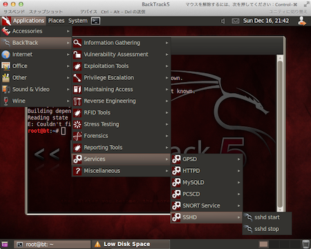

[](./backtrack_sshd_start.png) VMware Fusion上の仮想BackTrack5(GNOME 64bit版)にデフォルトで導入されているsshdを起動した状態でホストOS (Mac OS)のTerminalクライアントからssh接続を試みたところ、下記のエラーが発生した。 
<!-- truncate -->


### 事象

```
$ ssh root@XXX.XXX.XXX.XXX
Read from socket failed: Connection reset by peer

```

追記(2012-12-29)：原因は初回起動時の鍵生成をしていなかった為。下記コマンドにて生成する。 参考サイト(Official Wiki)：Basic Usage - BackTrack Linux (out of date: This project seems to have moved to Kali (Kali.org) but unfortunately, there is no link I can introduce. Thank you, Anthony Clarke for pointing this out.)

> When using a ssh server for the first time on Backtrack you will need to generate keys:
> 
> ```
> root@bt:~# sshd-generate
> 
> ```

### 実行結果

(ローカル環境です。)

```
root@bt:~# sshd-generate
Generating public/private rsa1 key pair.
Your identification has been saved in /etc/ssh/ssh_host_key.
Your public key has been saved in /etc/ssh/ssh_host_key.pub.
The key fingerprint is:
b4:b5:1e:9a:60:de:57:90:14:0b:97:18:bb:c4:3b:07 root@bt
The key's randomart image is:
+--[RSA1 2048]----+
|        oo+o     |
|       ..=.o     |
|        E =      |
|       o * o     |
|      o S + .    |
|     o o * o     |
|      . + o      |
|         .       |
|                 |
+-----------------+
Generating public/private rsa key pair.
Your identification has been saved in /etc/ssh/ssh_host_rsa_key.
Your public key has been saved in /etc/ssh/ssh_host_rsa_key.pub.
The key fingerprint is:
07:1a:62:b4:68:79:6e:53:dd:1e:ca:e1:28:89:7a:78 root@bt
The key's randomart image is:
+--[ RSA 2048]----+
|    .            |
|   + . . .       |
|  + = o + o      |
| . = + * = .     |
|  . * o S o      |
| o . o   .       |
|o E              |
| o               |
|                 |
+-----------------+
Generating public/private dsa key pair.
Your identification has been saved in /etc/ssh/ssh_host_dsa_key.
Your public key has been saved in /etc/ssh/ssh_host_dsa_key.pub.
The key fingerprint is:
27:7c:2e:00:13:76:eb:c1:0c:45:28:a9:34:a5:53:b1 root@bt
The key's randomart image is:
+--[ DSA 1024]----+
|  .==++          |
| o=.o* .         |
|.+.Eo =          |
|. .  + o         |
|      o S o      |
|       . =       |
|        . .      |
|         .       |
|                 |
+-----------------+
root@bt:~#

```

今後、システムの起動と同時にsshdも起動したい場合は、起動スクリプトを下記の用に設定する。

```
root@bt:~# update-rc.d -f ssh defaults
update-rc.d: warning: ssh stop runlevel arguments (0 1 6) do not match LSB Default-Stop values (none)
 Adding system startup for /etc/init.d/ssh ...
   /etc/rc0.d/K20ssh -> ../init.d/ssh
   /etc/rc1.d/K20ssh -> ../init.d/ssh
   /etc/rc6.d/K20ssh -> ../init.d/ssh
   /etc/rc2.d/S20ssh -> ../init.d/ssh
   /etc/rc3.d/S20ssh -> ../init.d/ssh
   /etc/rc4.d/S20ssh -> ../init.d/ssh
   /etc/rc5.d/S20ssh -> ../init.d/ssh
root@bt:~#

```

仮にクライアントからのログイン時にWARNING: REMOTE HOST IDENTIFICATION HAS CHANGED!が発生した場合はメッセージに従って対応。↓ [ssh: 解決法 – WARNING: REMOTE HOST IDENTIFICATION HAS CHANGED! Yukun's Blog](/blog/sshd-warning-remote-host-identification-has-changed)

#### 下記は上述の解決策に気づく前にOpensshを再インストールして対処したもの(ご参考まで)

。。。 /etc/ssh/sshd\_configファイルを確認したところ、 PermitRootLogin yes であることは確認済み。/var/log/secureログの内容も確認しておきたかったが、発生当時は急ぎssh接続をしたかったので、下記コマンドでopenssh-serverを再インストールすることで対処した。

### 対処例

```
# apt-get --purge remove openssh-server
# apt-get install openssh-server

```

### 実行結果

インストール後再度sshdを起動の上接続を試みたところ下記の通り接続できた。

```
$ ssh root@XXX.XXX.XXX.XXX
The authenticity of host 'XXX.XXX.XXX.XXX (XXX.XXX.XXX.XXX)' can't be established.
RSA key fingerprint is xx:xx:xx:xx:xx:xx:xx:xx:xx:xx:xx:xx:xx:xx:xx:xx.
Are you sure you want to continue connecting (yes/no)? yes
Warning: Permanently added 'XXX.XXX.XXX.XXX' (RSA) to the list of known hosts.
root@XXX.XXX.XXX.XXX's password:
＜後略＞

```
